# CGPC 2024

> 2024 CCF图形学启明星计划夏令营

## 0. 总览

* 官网：https://cgpc2024.github.io/about.html
* 今天夏令营聚焦在 **渲染** 专题上

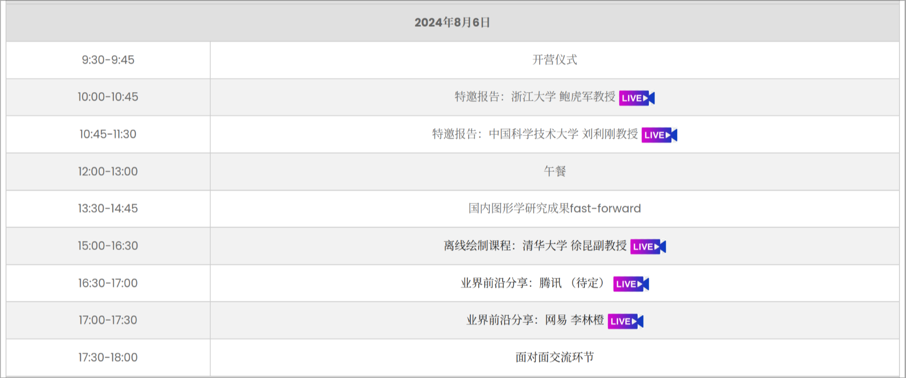

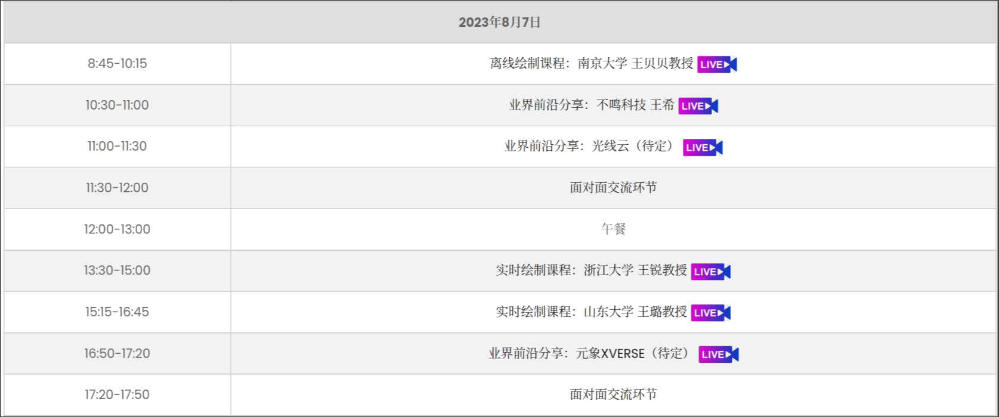

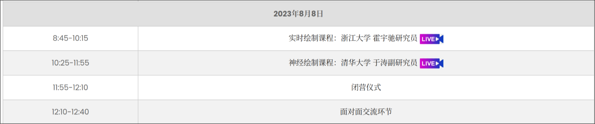

## Day1.1 全息数字人

> 鲍虎军

* 目标：全息媒体、全息数字人
  * 实例：Vision Pro(但做的不是很好)

### 1. 重要技术

* 多视图立体几何，Multiple View Stereo
  * 定义：Multiple View Stereo 是立体视觉的扩展，使用多个视角拍摄的图像来进行三维重建
  * 重要问题：精确匹配，找到对应的特征点
* 神经辐射场，NeRF
  * 定义：NeRF是在 **重建光场**
  * 早期问题：需要极其稠密的采样和大量时间进行重建
* 全息数字人
  * 重要问题：高精度、多模态、便捷性
  * 传统思路（显式表达重建）：复杂的硬件设备和流程
    * 问题：流程长（导致了误差积累）、不可微
  * 神经隐式重建
    * 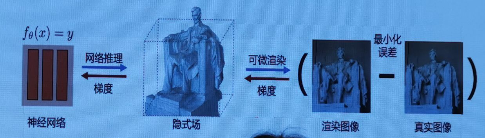

### 2. 低成本 建模技术

* 方法：SDF表达模型 + NeRF进行优化和重建
  * 精度：普通手机拍摄的视频，实现1mm以内重建
* 未来工作：不同型号的手机，如何同步并进行重建

### 3. 数字人多目动态重建

* Neural Body
  * 【没听懂】
  * 技术1：SMPL Human Model
* 未来工作：遮挡、多人近距离交互
* 【略】
* 视频驱动的嘴形/表情/动作生成

* 未来工作：数字人自主交互（与环境交互、与自然人交互）

### 4. NeRF相关

* Efficient NeRF
* 4K4D: Real-Time 4D View Synthesis at 4K Resolution
  * 问题：长视频对显存要求高
    * 解决：Temporal Gaussian xxx
  * 可以在Vision Pro上跑，太酷了！

## Day1.2 图像/视频生成：从PBR到基于数据的合成

> 刘利刚
>
> 讲课讲得很好

* [刘利刚老师博客](https://staff.ustc.edu.cn/~lgliu/Resources/CG/What_is_CG.html)
* PBR vs 基于数据的合成
  * PBR：传统渲染方式
  * 基于数据的合成：如今基于深度学习的合成方法
* 基本知识
  * 光、颜色、材质、视点相关
  * 渲染的两个基本问题：数据表征、计算方法
* PBR：基于第一性原理计算像素颜色
  * 数据表征 -> 场景
  * 计算方法 -> 颜色
* 计算机图形学：基于第一性原理的世界仿真
  * 建模-几何、渲染-色彩、动画-运动

### 1. 计算机图形学

#### 1.1 建模

* 3D曲面模型数据的构建
  * 集合数据、uv展开、贴图（纹理）、材质、灯光、动画

#### 1.2 渲染

* 投影方法：光栅化（把物体投影到屏幕）、光线追踪（从屏幕发射光线）
* 颜色计算：解渲染方程
  * 直接光照：Phong模型
  * 全局光照
    * 困难：无解析解、复杂度高
    * 求解方法：Monte Carlo、有限元方法（Radiosity，PBGI）【学一下】
    * MIS和RIS
      * MIS：多重重要性采样
      * RIS：俄罗斯轮盘和分裂
* 【GAMES303马上出了！yan+王贝贝老师】

#### 1.3 模拟计算

* 运动的计算科学：GAMES103、GAMES201
* 应用：布料模拟、流体仿真

#### 1.4 应用

* 两类大应用：视频、实物
* 视频
  * 刘利刚老师在博士第二年开始玩帝国时代
  * 游戏、电影、etc
* 实物
  * CAD

### 2. 三维场景中的渲染

* Recap: 面表达及面渲染
  * 体渲染（颗粒、透明物体）

#### 2.1 体表达

* 体表达，近几年的趋势（NeRF等）
  * 问题：根据少量照片 -> 新的照片
  * 方法一：3D重建生成、3D场景表达
  * 方法二：图像插值等2D图像算法
* 多视点图像重建3D物体
  * MVS等
* 可微渲染
  * TODO
* 3D表征的探索
  * 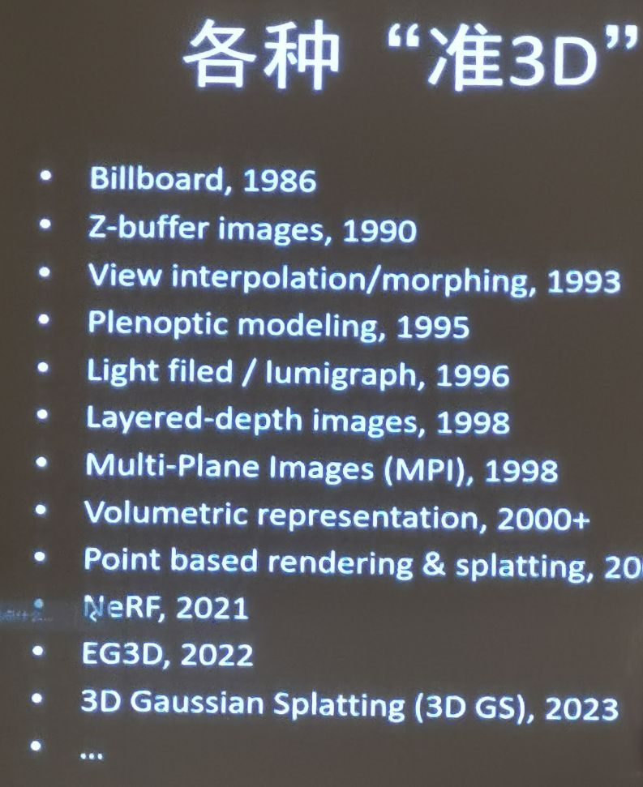
* 如何由多视点图像重建复杂3D物体？
  * 将光路简化：直接光路
  * 【没听懂】

#### 2.2 NeRF: Neural Radiance Fields

* 优点：可微
* 一个技术：位置编码【TODO】
  * 老师说，这东西很关键，很常用

#### 2.3 Gaussian Function

* 用若干的3D基函数拟合一个体函数
* 【3DGS和SDF表达场景，有什么区别？】
  * 3DGS适合光栅化；SDF适合光追
  * 3DGS是模糊表达；SDF适合精细表达

#### 2.4 Neural Rendering

* 用网络来渲染
* 技术问题：如何做latent code（如何转化输入）
* 【刘利刚老师给了一个summary图表，去回放找一下】

### 3. 基于数据的合成

* 实例：Image Analogies [Siggraph 2002]
* ...etc
* 基于大模型的视频合成
* 【刘利刚老师给了一个summary图表，去回放找一下】

## Day1.3 国内CG研究成果fast-forward

## Day1.4 离线渲染1：光线追踪算法原理

> 徐昆
>
> 讲课讲的很好

### 1. 数理基础

* 概率论

  * 随机变量、概率、分布
  * 针对连续随机变量：CDF、PDF
  * 常见分布
  * 期望、方差：$Var(X) = E(X^2) - E^2(X)$
    * **估计量的无偏性、有效性、一致性**
    * 无偏性：**估计量的期望 等于 总体均值**
    * 有效性：估计量 围绕 总体均值 的 **方差小**
    * 一致性：随着样本量的增加，估计值的方差逐渐减小，依概率收敛到 总体均值
    * 一致性非常重要，如果蒙特卡洛积分不满足一致性，那么增加spp噪点就可能会变多（？）
      * （可能不是那么恰当）
  * 多维随机变量
  * 均值估计
    * 先采样再求均值【无偏估计复习一下，指的好像是 $E(\hat{X})=E(X)$】
  * 随机分布采样
    * 问题：给定一个[0, 1]均匀分布，如何从任意一个分布中采样
    * 方法一：逆变换采样法
      * 先求出CDF，再对CDF求逆，然后把[0, 1]当作自变量，既可得到对应分布的一个随机值
      * 进一步：二维情况
        * 简单情况：密度函数可分解，直接分解算
        * 一般情况：【没听懂】
    * 方法二：拒绝采样法
      * 例子：求单位圆或一个任意形状内的均匀分布
      * 找一个辅助分布，来得到所求分布
  * 二维流型采样
    * 例子：比如半球面采样等
    * 方法一：构造一个 保面积映射，然后直接在原正方形上采样即可
      * 详细算法略
      * 例子：在三角形上采样

### 2. 蒙特卡洛积分

* 定义
  * 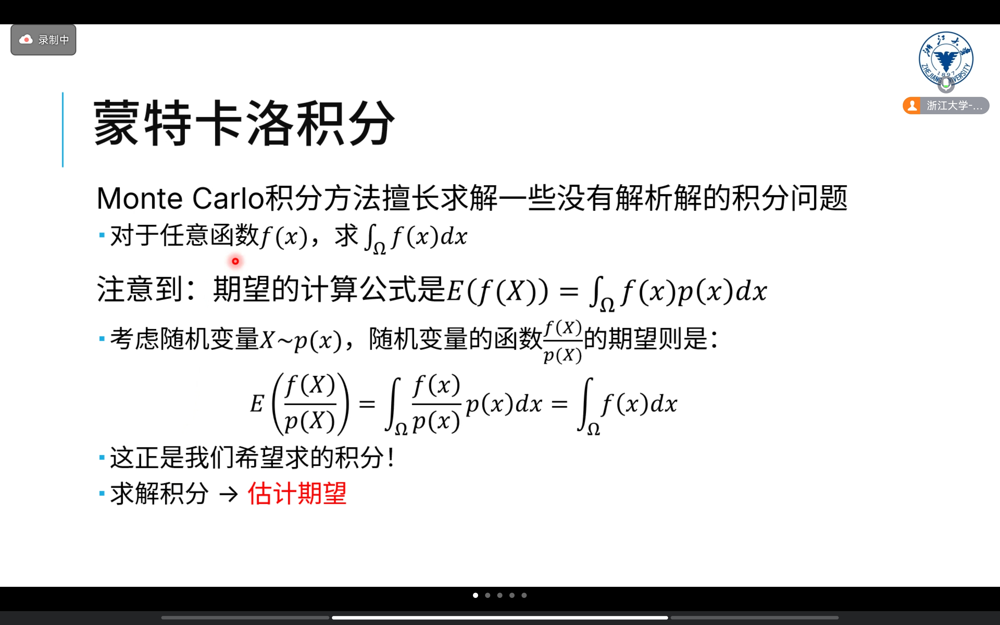
  * 用频率估计积分的期望
  * 可以证明，最后得到的对积分的估计是无偏的、收敛的
* 例子
  * 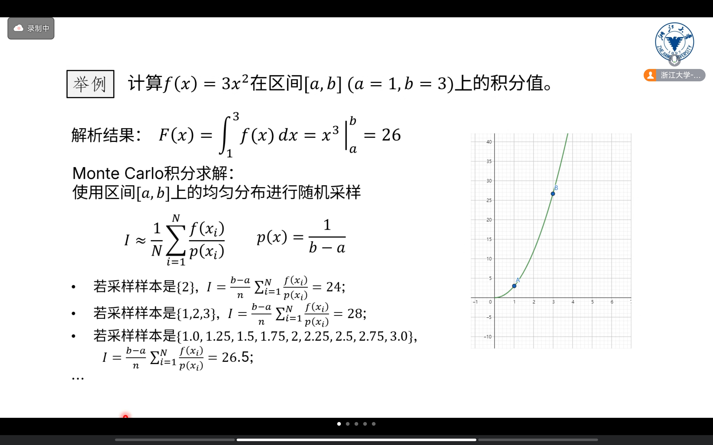
  * 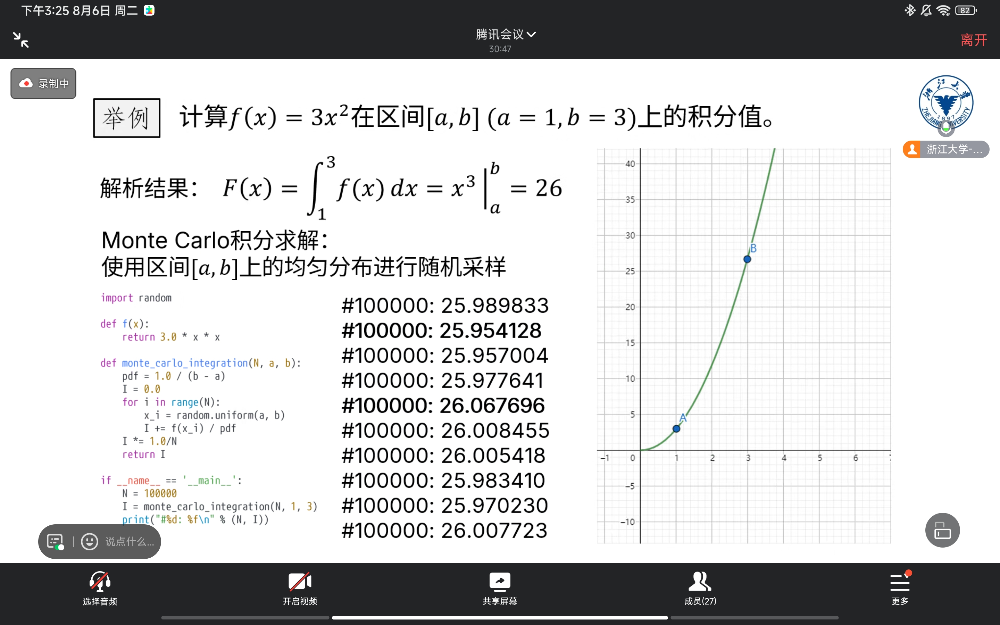
* 方差缩减
  * 目的：让方差减少的更快，减少算法复杂度
  * 接下来都是蒙特卡洛法的 **优化方法**
  * **重要性采样 Importance Sampling**
    * 人话：哪里概率大就优先采样那个地方，然后归一化
    * 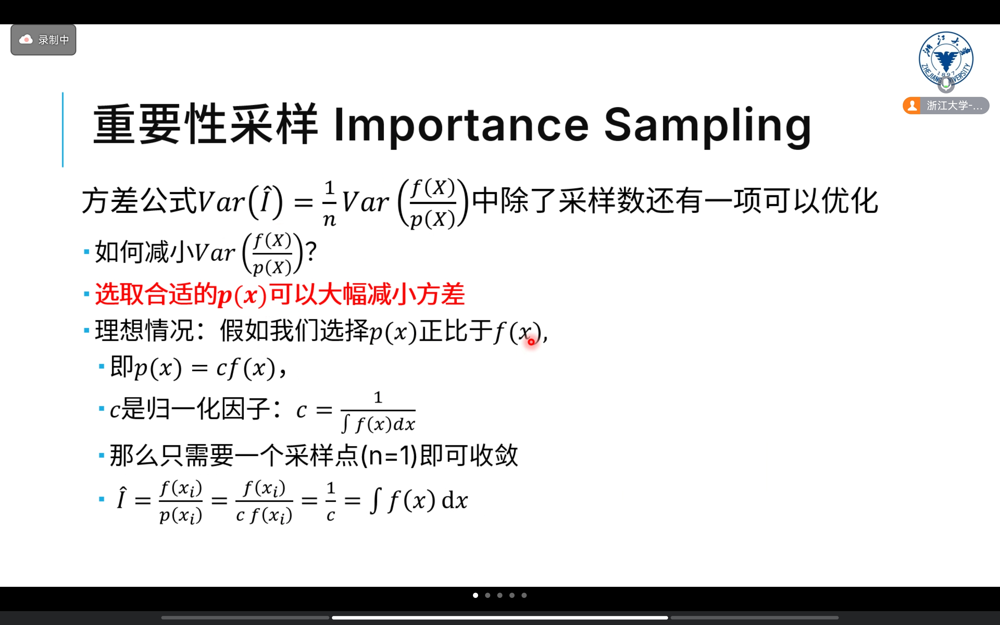
  * **多重重要性采样 MIS**
    * 问题：求解渲染时会经常遇到两个函数乘积的积分，没法只根据一个函数重要性采样
    * 注：MIS可以推广到多个函数（不止两个）
    * 【没听懂，感觉非常启发式】
      * 参考资料：[DezemingFamily博客](https://dezeming.top/wp-content/uploads/2022/12/%E5%A4%9A%E9%87%8D%E9%87%8D%E8%A6%81%E6%80%A7%E9%87%87%E6%A0%B7.pdf)
    * 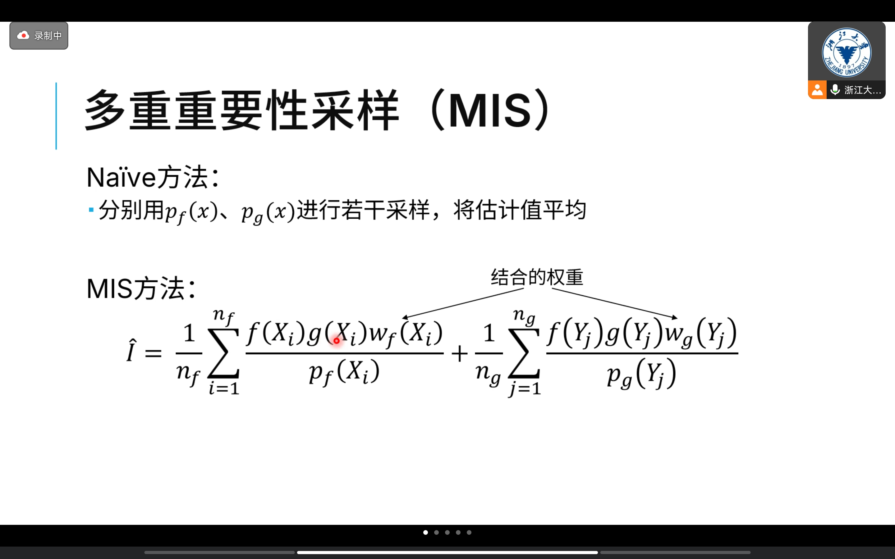
    * 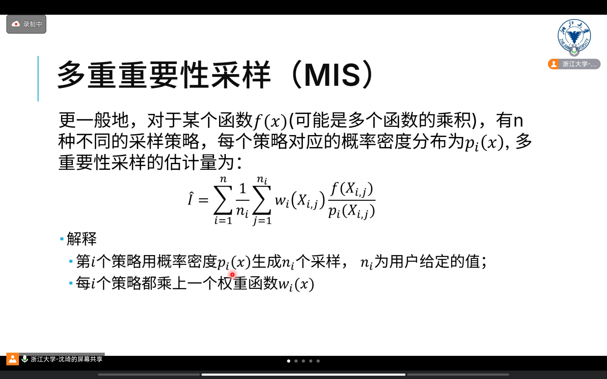
    * 
    * 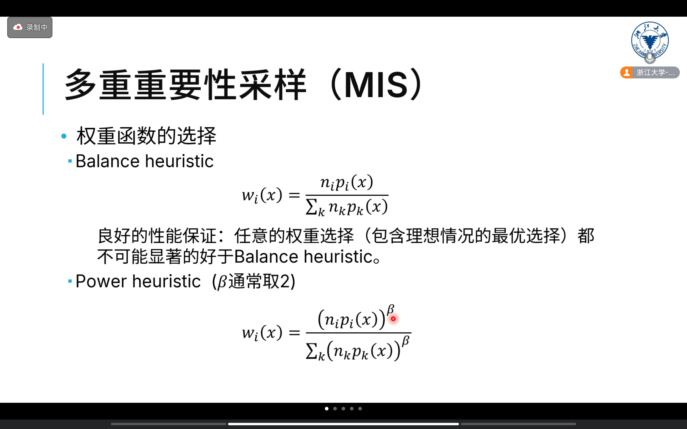
  * **分层采样 Stratified Sampling**
    * 定义：把采样区域划分为多个，分别均匀采样，再求和
    * 数学上的理解：分层采样会采样多个负相关的样本，使得方差降低【这句话没理解】
  * **拟蒙特卡洛方法**
    * 核心：采样时使用低差异序列采样
    * 人话：指定一个采样序列
  * **俄罗斯轮盘赌 RR**
    * 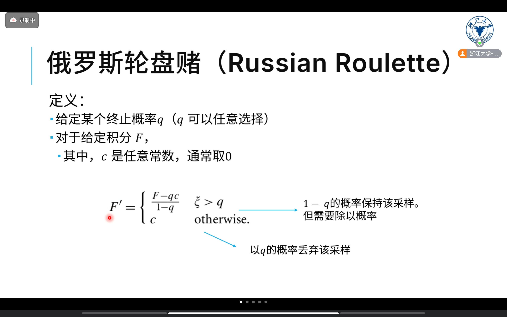
      * 注：这个常数c通常直接取0
    * 可以证明，这个方法是无偏的

### 3. 蒙特卡洛光线追踪

* 发展历史
  * Whitted Style RT
  * Path Tracing，主流光线追踪
    * Kajiya和渲染方程一起提出的
* RT的基本概念
  * 几何光学（光沿直线传播等等）、radiance
  * BSDF = BRDF & BTDF(透射)
  * BRDF描述 入射辐照度(irradiance) 和 反射光亮度(radiance)的关系
  * 渲染方程
    * 渲染方程本质上是积分，一个高维（无穷维）的积分
* 路径追踪
  * 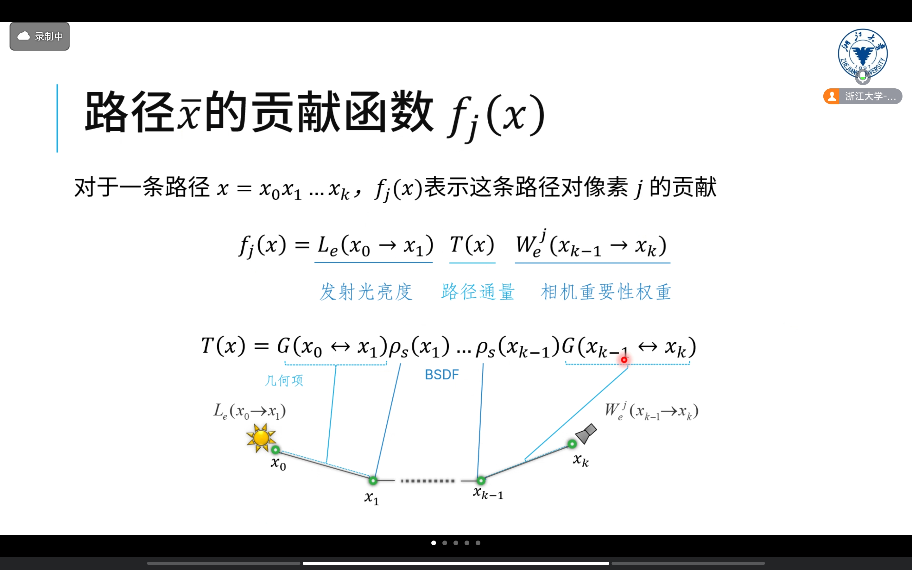
    * 几何项G(x -> y)
    * 对每个像素计算一个 **路径积分**
  * 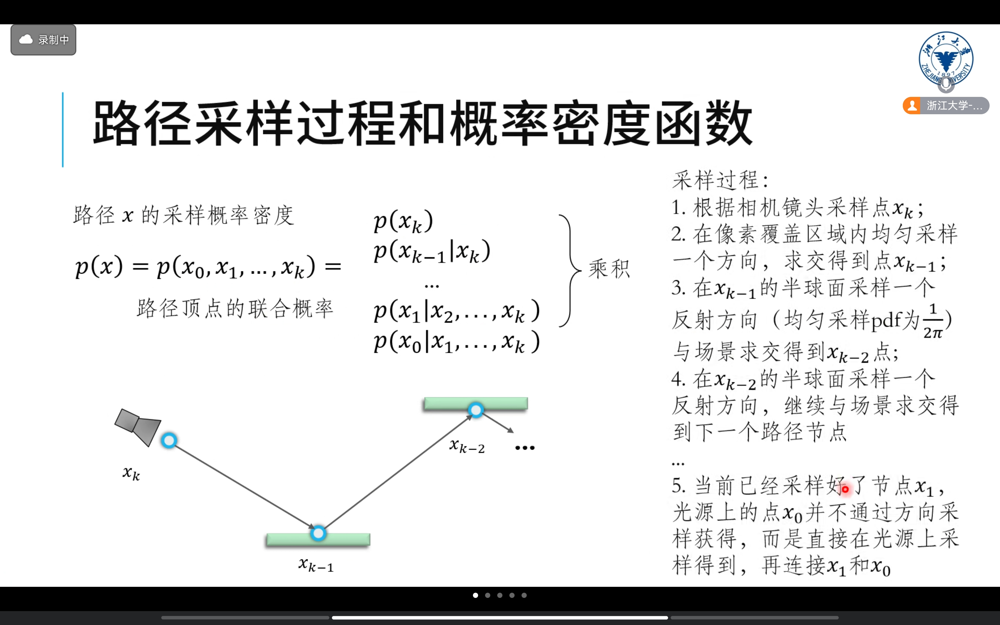
  * 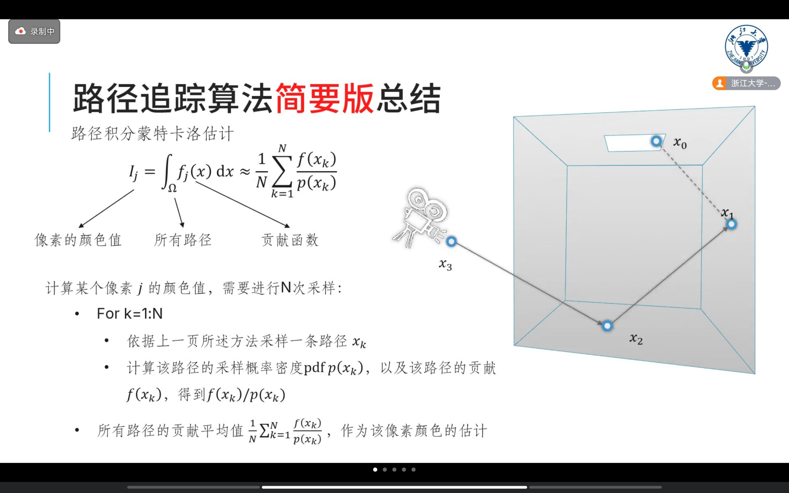
  * 问题
    * 问题一：路径长度（弹射次数）要限制多少？
    * 问题二：均匀采样速度慢
    * 问题三：路径重用【看不懂这个】
      * 就是一条路径当多条路径用
* 问题一：路径长度（弹射次数）要限制多少？
  * 方法一：设置路径最大深度
    * 问题：总有点在理论上不能被采样；没有无偏性
  * 方法二：俄罗斯轮盘赌 RR
    * 比如albedo=0.00001，那么就按照albedo概率继续追踪下去
    * 优点：同时保证了效率和无偏性
    * 注：记得归一化
    * 问题：RR丢弃的概率要设置为多少？
      1. 固定值
      2. 根据材质决定（比如根据反射率决定）
* 问题二：均匀采样速度慢
  * 解决方法：根据材质进行重要性采样
  * 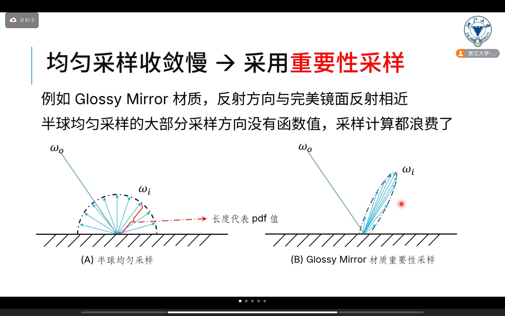
* Next Event Estimation (NEE)
  * 目的：路径重用
  * 方法：在path tracing的每一个采样点都计算光源的贡献
    * 相当于一条3个弹射点的路径，就生成了3条光路
    * 结合RR的新方法，无论RR是否通过，都会在光源上采样一个最终节点
* 直接光照估计：使用 **多重重要性采样**
  * 注：直接光照的路径长度为2（摄像机to采样点，采样点to光源）
  * 两种采样策略
    * 光源重要性采样：直接在光源上采样
      * 适合小光源
    * BRDF重要性采样：采样点根据BRDF采样，若不击中光源，则贡献为0
      * 适合大光源、采样点为glossy材质
    * 效果图
      * 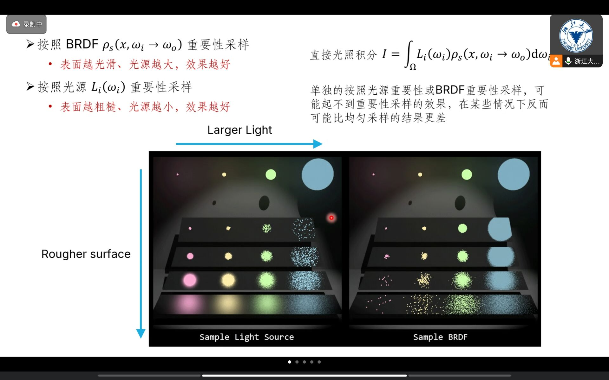
  * 最后，用MIS的理论结合两种采样方法
* **路径追踪总结**
  * 
* 参考资料
  * LuisaRender: https://luisa-render.com
  * smallpt

### 4. 渲染方法前沿

* 路径引导 Path Guiding
  * 基本思想：学习场景中各点的光场分布，从而决定采样方向
  * 先渲染一遍，用 **深度学习方法** 或者 **数据结构** 来学习光场分布，再进行PT
* 渲染降噪
* 路径复用：神经辐射缓存
  * 基本思想：使用轻量神经网络拟合、存储场景各点辐射场信息
  * 【感觉这个方法类似于基函数拟合光场？】
* 重要性重采样（RIS）
  * 【TODO】

### 5. 光线求交加速和GPU光追

* Motivation：光线求交太慢
* 加速的基本思路
  * 包围体：AABB
  * 加速结构：层次包围体、空间剖分
  * GPU硬件
  * 降噪算法
* OptiX API
* 工程上高效，需要注意：访存一致性、etc

### 6. 未来展望

## Day1.5 腾讯：实战中的实时渲染

> 袁亚振

* 项目vs研究
  * 项目短板不能太短
  * PPT、源码是否能快速复现
  * 方案是否Production Proven

* 全动飞行模拟项目
* FSR2
  * MSAA GBuffer
  * 通过直接MSAA GBuffer，使得不用增加采样次数就可以增加分辨率
* 光照烘焙
  * 预处理
  * 三种技术路线
    * Irradiance + Lightmap => 静态物体 + 静态光源
    * Irradiance + Light Probe => 动态物体 + 静态光源
    * PRT + Light Probe => 动态物体 + 动态光源
  * 挑战：困难路径采样，即间接光采样
    * Practical Path Guiding
  * 挑战：超大规模光源
  * 挑战：超大规模场景
* 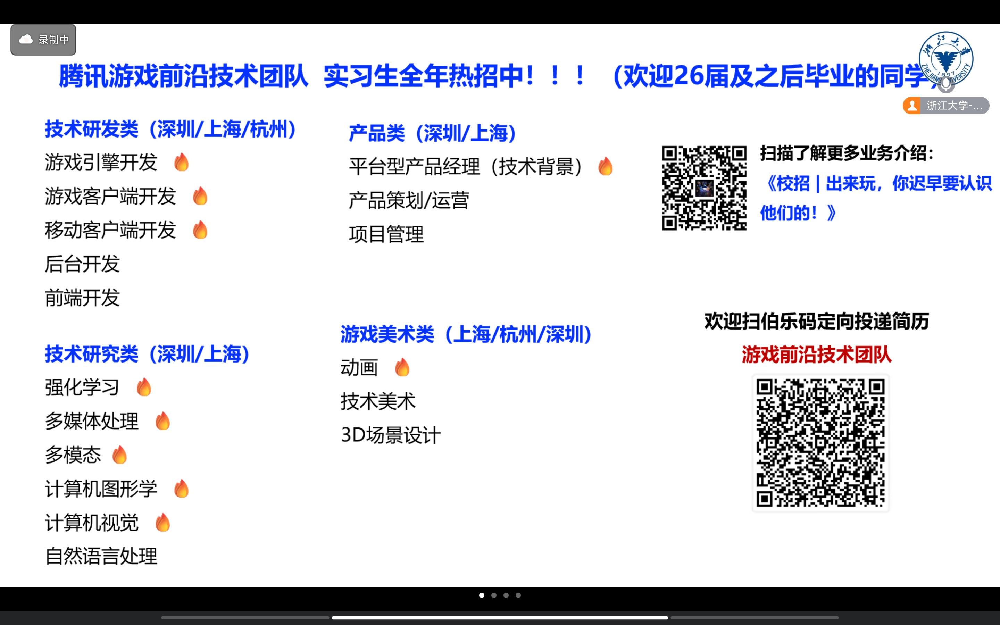
* 
* 
* 
* 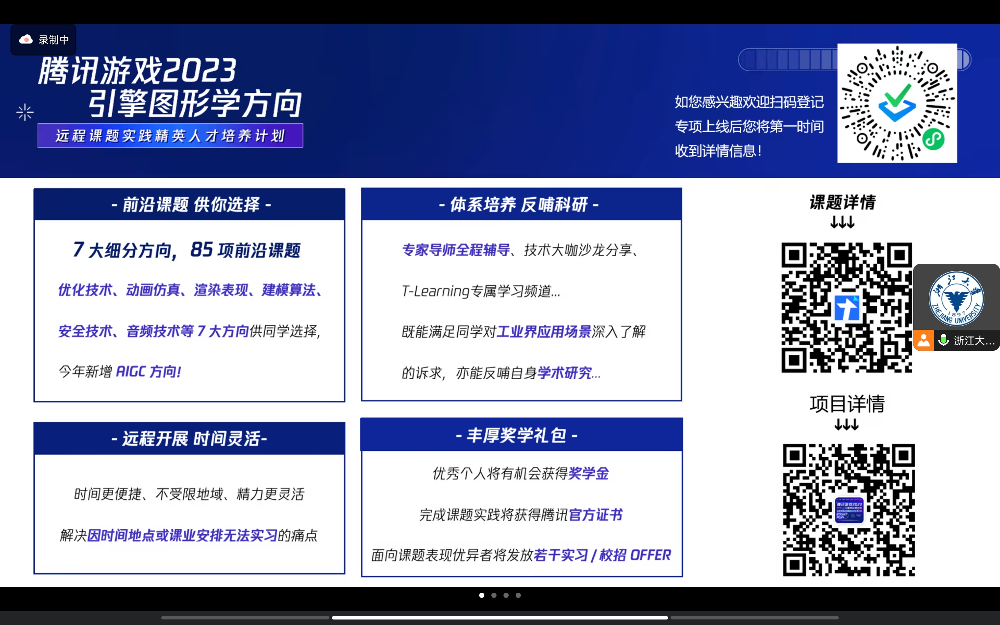
* etc（略）

## Day1.6 网易：游戏资产的智能创建 (3D AIGC)

> 网易伏羲 李林橙

### 1. 角色

* 捏脸系统
  * 自动化捏脸（输入图像；输出参数）
* text-to-character
  * toB：提高开发效率
  * toC：玩家自定义
* text-to-others (clothes, hair)
* 交互式多轮角色创建
  * 论文名为：ICE
  * 这个帅！

### 2. 场景

* text-to-model
* text-to-scene
* fonts generation
* ...

### 3. 招聘

* 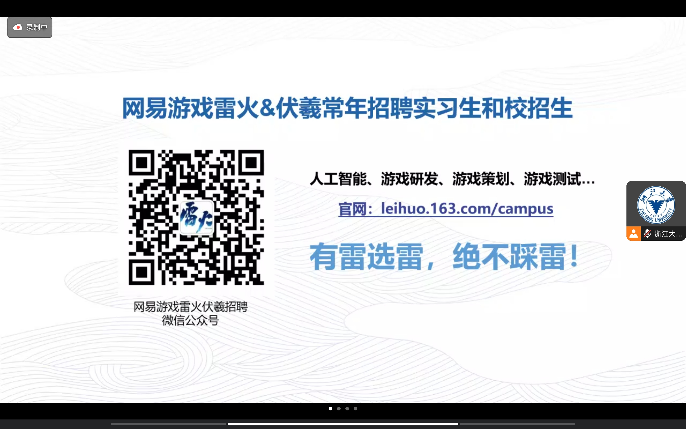

***

## Day2.1 离线渲染2：

