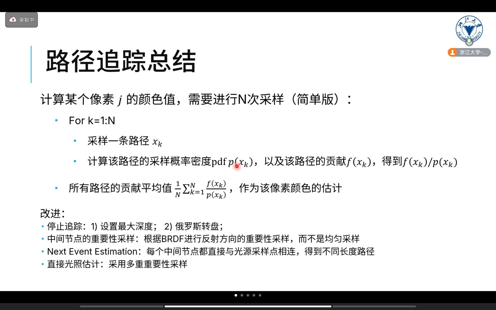

# CGPC 2024

> 2024 CCF图形学启明星计划夏令营

## 0. 总览

* 官网：https://cgpc2024.github.io/about.html
* 今年夏令营聚焦在 **渲染** 专题上

## Day1.1 全息数字人

> 鲍虎军

* 目标：全息媒体、全息数字人
  * 实例：Vision Pro(但做的不是很好)

### 1. 重要技术

* 多视图立体几何，Multiple View Stereo
  * 定义：Multiple View Stereo 是立体视觉的扩展，使用多个视角拍摄的图像来进行三维重建
  * 重要问题：精确匹配，找到对应的特征点
* 神经辐射场，NeRF
  * 定义：NeRF是在 **重建光场**
  * 早期问题：需要极其稠密的采样和大量时间进行重建
* 全息数字人
  * 重要问题：高精度、多模态、便捷性
  * 传统思路（显式表达重建）：复杂的硬件设备和流程
    * 问题：流程长（导致了误差积累）、不可微
  * 神经隐式重建
    * 

### 2. 低成本 建模技术

* 方法：SDF表达模型 + NeRF进行优化和重建
  * 精度：普通手机拍摄的视频，实现1mm以内重建
* 未来工作：不同型号的手机，如何同步并进行重建

### 3. 数字人多目动态重建

* Neural Body
  * 【没听懂】
  * 技术1：SMPL Human Model
* 未来工作：遮挡、多人近距离交互
* 【略】
* 视频驱动的嘴形/表情/动作生成

* 未来工作：数字人自主交互（与环境交互、与自然人交互）

### 4. NeRF相关

* Efficient NeRF
* 4K4D: Real-Time 4D View Synthesis at 4K Resolution
  * 问题：长视频对显存要求高
    * 解决：Temporal Gaussian xxx
  * 可以在Vision Pro上跑，太酷了！

## Day1.2 图像/视频生成：从PBR到基于数据的合成

> 刘利刚
>
> 讲课讲得很好

* [刘利刚老师博客](https://staff.ustc.edu.cn/~lgliu/Resources/CG/What_is_CG.html)
* PBR vs 基于数据的合成
  * PBR：传统渲染方式
  * 基于数据的合成：如今基于深度学习的合成方法
* 基本知识
  * 光、颜色、材质、视点相关
  * 渲染的两个基本问题：数据表征、计算方法
* PBR：基于第一性原理计算像素颜色
  * 数据表征 -> 场景
  * 计算方法 -> 颜色
* 计算机图形学：基于第一性原理的世界仿真
  * 建模-几何、渲染-色彩、动画-运动

### 1. 计算机图形学

#### 1.1 建模

* 3D曲面模型数据的构建
  * 集合数据、uv展开、贴图（纹理）、材质、灯光、动画

#### 1.2 渲染

* 投影方法：光栅化（把物体投影到屏幕）、光线追踪（从屏幕发射光线）
* 颜色计算：解渲染方程
  * 直接光照：Phong模型
  * 全局光照
    * 困难：无解析解、复杂度高
    * 求解方法：Monte Carlo、有限元方法（Radiosity，PBGI）
      * 【学一下，有限元方法】
    * MIS和RIS
      * MIS：多重重要性采样
      * RIS：俄罗斯轮盘和分裂
* 【GAMES303马上出了！yan+王贝贝老师】

#### 1.3 模拟计算

* 运动的计算科学：GAMES103、GAMES201
* 应用：布料模拟、流体仿真

#### 1.4 应用

* 两类大应用：视频、实物
* 视频
  * 刘利刚老师在博士第二年开始玩帝国时代
  * 游戏、电影、etc
* 实物
  * CAD

### 2. 三维场景中的渲染

* Recap: 面表达及面渲染
  * 体渲染（颗粒、透明物体）

#### 2.1 体表达

* 体表达，近几年的趋势（NeRF等）
  * 问题：根据少量照片 -> 新的照片
  * 方法一：3D重建生成、3D场景表达
  * 方法二：图像插值等2D图像算法
* 多视点图像重建3D物体
  * MVS等
* 可微渲染
  * TODO
* 3D表征的探索
  * 
* 如何由多视点图像重建复杂3D物体？
  * 将光路简化：直接光路
  * 【没听懂】

#### 2.2 NeRF: Neural Radiance Fields

* 优点：可微
* 一个技术：位置编码【TODO】
  * 老师说，这东西很关键，很常用

#### 2.3 Gaussian Function

* 用若干的3D基函数拟合一个体函数
* 【3DGS和SDF表达场景，有什么区别？】
  * 3DGS适合光栅化；SDF适合光追
  * 3DGS是模糊表达；SDF适合精细表达

#### 2.4 Neural Rendering

* 用网络来渲染
* 技术问题：如何做latent code（如何转化输入）
* 【刘利刚老师给了一个summary图表，去回放找一下】

### 3. 基于数据的合成

* 实例：Image Analogies [Siggraph 2002]
* ...etc
* 基于大模型的视频合成
* 【刘利刚老师给了一个summary图表，去回放找一下】

## Day1.3 国内CG研究成果fast-forward

## Day1.4 离线渲染1：光线追踪算法原理

> 徐昆
>
> 讲课讲的很好

### 1. 数理基础

* 概率论

  * 随机变量、概率、分布
  * 针对连续随机变量：CDF、PDF
  * 常见分布
  * 期望、方差：$Var(X) = E(X^2) - E^2(X)$
    * **估计量的无偏性、有效性、一致性**
    * 无偏性：**估计量的期望 等于 总体均值**
    * 有效性：估计量 围绕 总体均值 的 **方差小**
    * 一致性（收敛的）：随着样本量的增加，估计值的方差逐渐减小，依概率收敛到 总体均值
    * 一致性非常重要，如果蒙特卡洛积分不满足一致性，那么增加spp噪点就可能会变多（？）
      * （可能不是那么恰当）
  * 多维随机变量
  * 均值估计
    * 先采样再求均值【无偏估计复习一下，指的好像是 $E(\hat{X})=E(X)$】
  * 随机分布采样
    * 问题：给定一个[0, 1]均匀分布，如何从任意一个分布中采样
    * 方法一：逆变换采样法
      * 先求出CDF，再对CDF求逆，然后把[0, 1]当作自变量，既可得到对应分布的一个随机值
      * 进一步：二维情况
        * 简单情况：密度函数可分解，直接分解算
        * 一般情况：【没听懂】
    * 方法二：拒绝采样法
      * 例子：求单位圆或一个任意形状内的均匀分布
      * 找一个辅助分布，来得到所求分布
  * 二维流型采样
    * 例子：比如半球面采样等
    * 方法一：构造一个 保面积映射，然后直接在原正方形上采样即可
      * 【详细算法略】
      * 例子：在三角形上采样

### 2. 蒙特卡洛积分

* 定义
  * 
  * 用频率估计积分的期望
  * 可以证明，最后得到的对积分的估计是无偏的、收敛的
* 例子
  * 
  * 
* 方差缩减
  * 目的：让方差减少的更快，减少算法复杂度
  * 接下来都是蒙特卡洛法的 **优化方法**
  * **重要性采样 Importance Sampling**
    * 人话：哪里概率大就优先采样那个地方，然后归一化
    * 
  * **多重重要性采样 MIS**
    * 问题：求解渲染时会经常遇到两个函数乘积的积分，没法只根据一个函数重要性采样
    * 注：MIS可以推广到多个函数（不止两个）
    * 【没听懂，感觉非常启发式】
      * 参考资料：[DezemingFamily博客](https://dezeming.top/wp-content/uploads/2022/12/%E5%A4%9A%E9%87%8D%E9%87%8D%E8%A6%81%E6%80%A7%E9%87%87%E6%A0%B7.pdf)
      * *感觉就是用一个加权平均来考虑多个函数*
        * 【感觉我没听懂的原因是，没有写过IS的代码，对IS理解不够】
    * 
    * 
    * 
    * 
  * **分层采样 Stratified Sampling**
    * 定义：把采样区域划分为多个，分别均匀采样，再求和
    * 数学上的理解：分层采样会采样多个负相关的样本，使得方差降低【负相关？】
  * **拟蒙特卡洛方法**
    * 核心：采样时使用低差异序列采样
    * 人话：指定一个采样序列
  * **俄罗斯轮盘赌 RR**
    * 
      * 注：这个常数c通常直接取0
    * 可以证明，这个方法是无偏的

### 3. 蒙特卡洛光线追踪

* 发展历史
  * Whitted Style RT
  * Path Tracing，主流光线追踪
    * Kajiya和渲染方程一起提出的
* RT的基本概念
  * 几何光学（光沿直线传播等等）、radiance
  * BSDF = BRDF & BTDF(透射)
  * BRDF描述 入射辐照度(irradiance) 和 反射光亮度(radiance)的关系
  * 渲染方程
    * 渲染方程本质上是积分，一个高维（无穷维）的积分
* 路径追踪
  * 
    * 几何项G(x -> y)
    * 对每个像素计算一个 **路径积分**
  * 
  * 
  * 问题
    * 问题一：路径长度（弹射次数）要限制多少？
    * 问题二：均匀采样速度慢
    * 问题三：路径重用【看不懂这个】
      * 就是一条路径当多条路径用
* 问题一：路径长度（弹射次数）要限制多少？
  * 方法一：设置路径最大深度
    * 问题：总有点在理论上不能被采样；没有无偏性
  * 方法二：俄罗斯轮盘赌 RR
    * 比如albedo=0.00001，那么就按照albedo概率继续追踪下去
    * 优点：同时保证了效率和无偏性
    * 注：记得归一化
    * 问题：RR丢弃的概率要设置为多少？
      1. 固定值
      2. 根据材质决定（比如根据反射率决定）
* 问题二：均匀采样速度慢
  * 解决方法：根据材质进行重要性采样
  * 
* Next Event Estimation (NEE)
  * 目的：路径重用
  * 方法：在path tracing的每一个采样点都计算光源的贡献
    * 相当于一条3个弹射点的路径，就生成了3条光路
    * 结合RR的新方法，无论RR是否通过，都会在光源上采样一个最终节点
* 直接光照估计：使用 **多重重要性采样**
  * 注：直接光照的路径长度为2（摄像机to采样点，采样点to光源）
  * 两种采样策略
    * 光源重要性采样：直接在光源上采样
      * 适合小光源
    * BRDF重要性采样：采样点根据BRDF采样，若不击中光源，则贡献为0
      * 适合大光源、采样点为glossy材质
    * 效果图
      * 
  * 最后，用MIS的理论结合两种采样方法
* **路径追踪总结**
  * 
* 参考资料
  * LuisaRender: https://luisa-render.com
  * smallpt

### 4. 渲染方法前沿

* 路径引导 Path Guiding
  * 基本思想：学习场景中各点的光场分布，从而决定采样方向
  * 先渲染一遍，用 **深度学习方法** 或者 **数据结构** 来学习光场分布，再进行PT
* 渲染降噪
* 路径复用：神经辐射缓存
  * 基本思想：使用轻量神经网络拟合、存储场景各点辐射场信息
  * 【感觉这个方法类似于基函数拟合光场？】
* 重要性重采样（RIS）
  * 【TODO】

### 5. 光线求交加速和GPU光追

* Motivation：光线求交太慢
* 加速的基本思路
  * 包围体：AABB
  * 加速结构：层次包围体、空间剖分
  * GPU硬件
  * 降噪算法
* OptiX API
* 工程上高效，需要注意：访存一致性、etc

### 6. 未来展望

## Day1.5 腾讯：实战中的实时渲染

> 袁亚振

* 项目vs研究
  * 项目短板不能太短
  * PPT、源码是否能快速复现
  * 方案是否Production Proven

* 全动飞行模拟项目
* FSR2
  * MSAA GBuffer
  * 通过直接MSAA GBuffer，使得不用增加采样次数就可以增加分辨率
* 光照烘焙
  * 预处理
  * 三种技术路线
    * Irradiance + Lightmap => 静态物体 + 静态光源
    * Irradiance + Light Probe => 动态物体 + 静态光源
    * PRT + Light Probe => 动态物体 + 动态光源
  * 挑战：困难路径采样，即间接光采样
    * Practical Path Guiding
  * 挑战：超大规模光源
  * 挑战：超大规模场景
* 
* 
* 
* 
* 
* etc（略）

## Day1.6 网易：游戏资产的智能创建 (3D AIGC)

> 网易伏羲 李林橙

### 1. 角色

* 捏脸系统
  * 自动化捏脸（输入图像；输出参数）
* text-to-character
  * toB：提高开发效率
  * toC：玩家自定义
* text-to-others (clothes, hair)
* 交互式多轮角色创建
  * 论文名为：ICE
  * 这个帅！

### 2. 场景

* text-to-model
* text-to-scene
* fonts generation
* ...

### 3. 招聘

* 

***

## Day2.1 离线渲染2：真实感材质建模

> 王贝贝
>
> 讲课讲的很好

* 大纲
  * 材质建模基本
  * 材质模型
  * 近期进展
  * 目标：能在shadertoy上自己写一个cuxxx model
* 渲染方程
  * 核心是BRDF函数
  * 材质
    * 分类：diffuse、glossy、specular、透明、微结构
      * 【和微表面不一样？】
    * BSDF (Scattering) = BRDF(Reflection) + BTDF(Transmission)
    * 
* BRDF
  * 局部坐标系：以 **着色法向** 为z轴
  * BRDF定义为：出射光的微分辐射量度 / 入射光的微分辐照度
  * **辐射通量(flux)**：能量总量 / 单位时间
  * **辐照度(irradiance)**：辐射通量 / 单位面积 = 能量总量 / 单位时间 / 单位面积
  * **辐射率/辐射亮度(radiance)**：辐射通量密度 / 单位面积 / 单位立体角
  * 

### 1. 预备知识

* 着色法向 vs. 几何法向
  * 几何法向：三角形面的法向
  * 顶点法向：顶点相接所有面的 **几何法线的均值**
  * 着色法向：三个顶点的 **顶点法向 插值** 之后的法向（根据重心坐标）
* 方向的参数化
  * 
  * 注：如果BRDF要用神经网络表达时，参数化方法非常重要
  * BRDF有4个参数 $(\theta_i, \theta_o, \phi_i, \phi_o)$、而各向同性BRDF只有3个参数 $(\theta_i, \theta_o, |\phi_i - \phi_o|)$
* 几何光学 ~~和波动光学~~
  * 波动光学：几何/材质细节程度与光的波长尺度相当时
    * 学界上有人在研究，非常有意思，非常难
    * 例子：狗的毛发在某些时候会呈现彩色，这是几何光学无法解释的
* 表面渲染 ~~和体渲染~~
  * 表面模型(Surface Model)
    * **入射点和出射点为同一个点**
  * 体渲染
    * **从不同点出射**
    * 不用渲染方程描述，而是用 **辐射传输方程**
    * 具体模型例子：次表面散射(Subsurface Scattering)

### 2. 几种常见的材质模型

* Metrics

  * 真实性
    * 论文中如何证明真实感？
      * 如果是第一个，就现实中拍照
      * 如果有之前的论文，就和之前的论文比
  * 计算高效性、存储简洁性、表达形式统一性
  * 物理性：能量守恒（白炉测试）、可逆性
    * 白炉测试：把一个球放在 **纯白背景** 与 **纯白平行光** 下进行渲染，查看球是否是纯白的
    * 可逆性：$\omega_i$ 和 $\omega_o$ 互换，是否不变。BRDF可以不可逆，但论文提出的时候要说明清楚
  * 可编辑性
  * 重要性采样便捷
    * 因为BRDF很多时候会在PT里使用，所以支持重要性采样很重要

* 如何表示BRDF：测量模型 & 解析模型

* **测量模型**：直接用数据 (4D/3D表格)

  * MERL数据集(2003)：收集了100个材质在现实中的数据
  * **测量模型** 是一种 **数据驱动** 的模型
  * 

* **解析模型**：公式（经验模型、PBM）

  * **经验模型**

    * **Lambertian模型**（漫反射）
      * $f_d(\omega_i, \omega_o) = \rho / \pi$
      * 注：漫反射其实有很多其他模型，现在也有人在研究
    * **Blinn-Phong模型**（镜面反射模型）
      * 
    * [某个shadertoy](https://www.shadertoy.com/view/XIXGDj)

    * 经验模型的优缺点
      * 

  * **基于物理的模型：微表面模型 Microfacet Model**

    * 
    * 法向分布函数
      * 常见的NDF：Beckmann，GGX，GTR
      * GGX第一次提出了微表面模型的BTDF
      * GGX和GTR是主流
      * 【GTR这篇论文写得不错，GTR [Burley 2012]】
    * 遮挡函数
      * 
      * 常用的遮挡函数模型：**Smith模型**，V-Groove
      * **Smith模型** 目前是主流
      * 【上面PPT最下面的论文，是关于 **遮挡函数的综述论文**】
      * 
        * 注意图中蓝色线和绿色线：蓝色是不考虑遮挡的区域；绿色是考虑遮挡的区域
        * 【不确定，没怎么理解】
    * 菲涅尔项
      * 定义：表示了 **光线在两种不同折射率的介质中传播时的反射比例**
      * 两大类
        * 金属(conductor)：金属曲线更平缓；金属分为三通道（铜呈现黄铜色，就是因为菲涅尔项）
        * 非金属(dielectric)：非金属曲线根据角度变化大；
      * 原理
        * 金属的折射率是复数
      * [折射率网站](https://refractiveindex.info/)
      * 菲涅尔项的计算
        * 离线渲染中，很复杂
        * 实时渲染中，Schlick Approximation
    * [Shadertoy的Microfacet玩具](https://www.shadertoy.com/view/4sSfzK)
    * 注：微表面反射模型 没有漫反射、没有金属度
    * 注：Cook-Torrance模型 = Lambertian模型 + 微表面模型

  * Disney Principled Model

* 总结

* 其他BRDF

  * 基本：解析BRDF、测量BRDF
  * SVBRDF(Spatially xxx)
  * BTF(Bidirectional Texture Function)

### 3. 材质近期进展

* 
* 王贝贝老师是科研仙人
* 论文：From microfacets to participating media: A unified theory of light transport with stochastic geometry. Siggraph 2024 (Best paper)

## Day2.2 不鸣科技：当代游戏引擎的光照和几何处理前沿技术

> 王希

* 渲染方程
* 全局光照方法
  * RSM
  * LPV：空间体素化
  * SVOGI：用 数据结构 维护体素
  * VXGI：根据 距离 决定体素密度
  * SSGI：屏幕空间 + RT
* Lumen
  * 问题：GI需要过多ray
    * 思路：减少ray的数量
    * 方法：空间体素储存光照 + 屏幕空间Probe
  * 问题：远距离储存光照
    * 思路：通过各类方法if else结合在一起
    * 方法：World Space Radiance Cache
  * 问题：各类方法混合时会产生artifact
* ReSTIR (Reservoir-based Spatio-Temporal Importance Resampling)
  * 特点：基于GPU RT；简单实现；数千光源
  * 思路：通过高频BRDF采样 + 低频Visibility采样，混合得到一个数学上等价的采样
  * 思路2：RIS，复用周围的(Neighbour)光线和上一帧(Temporal)的光线
    * 【不知道这两个的关系】
  * 实例：cbpk2077, chaos引擎
* Nanite：略
* 未来展望
  * AI<->GI
  * 王希老师认为用AI做rendering非常有潜力，围绕人的perception做
* 王希老师面对面交流
  * Nanite相关的
    * 目前问题主要在带宽上，而不在渲染上

  * 游戏引擎中的脚本技术选型
    * 一个open question
    * python和lua各有优势
    * luau是lua的强类型拓展，lua jit可以加速lua运行效率
    * 网易正在转向用python（但王希老师觉得python太重量化了）
    * C#也有优势，但劣势是跨平台支持

  * 游戏引擎中的ECS和GameObject技术选型
    * 一个open question
    * 目前unity和unreal5的架构实际上都是十几年前的架构
      * 只是增加了一些新的feature（比如DOTS等），多开了几个线程用于专门支持新feature

    * 移动端，带宽问题比较大，所以有Tile-based Rendering
    * Unity和Unreal
      * 大厂，Unity通常是买源码，然后直接找一批引擎精锐去魔改Unity核心
      * Unreal因为是native c++的，所以大家也在改，但特别容易崩溃

## Day2.3 光线云：云原生实时渲染引擎 (RaysEngine)

> 王锐

### 1. 公司概述

* 美国限制认证

### 2. 技术背景

* 
* 视觉是主要信息输入
* RaysEngine，关注点为：云渲染

### 3. 引擎介绍

* Rays Engine
* Rays Editor
* 
  * (3) 自优化渲染计算框架：游戏做完可以丢进去自动化评估/优化
* 公司也在做科研，发了很多paper
* RaysEngine引擎与许多国产GPU、CPU、OS做了兼容
  * 国产GPU落后的其中一个原因就是 Graphics API 驱动太难写了

### 4. 产品服务

* RaysTools：光学仿真（透镜etc）
* 

## Day2.4 实时渲染1：GPU与渲染管线

> 王锐

* 渲染方程
  * PT、有限元
  * Local Shading
* 渲染管线
  * 固定管线 (OpenGL 1.0)
    * MT, Illumination (早期管线), VT, Clipping, PT, Rasterization, Visibility/Display
  * 可编程管线 (OpenGL 2.0)
    * etc
  * 更多特性 (OpenGL 3.2)
    * Geometry Shader, Tessellation, Compute Shader, etc
    * Mesh Shader
* Graphics APIs
  * 
* Shading Languages
  * HLSL (Microsoft)
  * GLSL (OpenGL / Vulkan)
  * MSL (Metal)
  * WGSL (WebGPU)
  * SPIR-V，中间格式(字节码)
  * 
* GPU Ray Tracing
  * OptiX
* Conclusion

## Day2.5 实时渲染2：实时渲染方法

> 王璐 山东大学
>
> 讲课讲的还是很清楚的

* RTR's Goal: Real-Time + High Quality

### 1. Shadow Mapping

* 常用SM算法有：SM、PCSS、VSSM、DFSS
* （感觉内容是RTR的子集）
* DFSS
  * 从着色点向光源ray marching，通过SDF加速，并得到一个最大角度，表示遮挡率，从而得到软阴影
* Shadowing in Unreal Engine
  * SM
  * Virtual Shadow Map (GPU-driven high-resolution shadow map)
  * DFSS
  * etc

### 2. 3D Space GI

* PRT
  * 预计算lighting项与light transport项，用基函数(SH, Wavelet, SG)储存下来
* Voxel-based GI (VXGI)
* Light Map
* Light Probe (Precomputed or Runtime)
* DDGI (Diffuse x GI)
* AMDGI (添加了Glossy材质)

### 3. Screen Space GI

* SSAO
* SSR

### 4. Real-time Ray Tracing

### 5. Our Work

* 用Neural Basis作为基函数
* Stereo-consistent SSR
  * 在VR中的SSR，两个眼睛看到的效果不同，论文提出了一个解决方案
* Temporally Reliable Motion Vectors for RTRT
  * 提出了一些新的Motion Vectors

### 6. Future Research

* 王璐老师锐评：全是未来工作，有好多可以做的
* Complex Geometry，对大规模场景/几何做快速操作
* Complex Material
* Complex Light
* Volumes
* Denoising
* VR Rendering：Perceptual models & Foveated Rendering；Stereo Consistency
* Mobile Rendering
* [博客](https://wanglusdu.github.io)

## Day2.6 元象：

> 朱
>
> 也拿过acm金

### 1. LBVR概念简介

* LBVR：Location-Based Virtual Reality
  * 基于位置的虚拟现实（大空间VR）
* 元象首个LBVR项目：幻旅之门
* 技术选型
  * 常见VR设备
    * PICO & Quest：安卓、虚幻
    * Apple Vision Pro：VisionOS、闭源
  * 使用Quest3 & 虚幻

### 2. VR端

* VR对性能要求高
  * VR如果只有几帧，可能带上去就会头晕呕吐
* 插帧
  * Meta官方提供的插帧工具 —— Application SpaceWarp (ASW)
  * Meta官方给Unreal写了插件，直接用就好
* 模型减面（曲面简化）
  * 元象主要使用QEM算法
  * 
  * 什么时候停止减面？
    * 豪斯多夫距离
    * 剪影Loss
* Mindtopia 已上线 Apple Vision Pro
* 动画
  * 手K动作
  * 视频动捕
  * 专业动捕
* PSO
  * 团队研究了一下如何在虚幻引擎中打包PSO，减少加载时间
* 全景双目视频的压缩方法
  * MV-HEVC

### 3. 总结

***

## Day3.1 神经渲染1：机器学习 + 图形绘制

> ZJU 霍宇驰

* 知识驱动 vs. 数据驱动
* Neural Rendering
* AI应用：Scene、GI

### 1. Scene

* 【能不能把mesh改成可微的？】
* Voxel-based Scene Representation
* Mesh-based Scene Representation
* Point-based Scene Representation
  * 3DGS
* Network-based Scene Representation
  * NeRF
* 

### 2. Global Illumination

* AO
  * DeepAO，用深度网络做SSAO
* Direct Illumination
* Indirect Illumination
* Volume and Subsurface
* Human-related Rendering

### 3. Global Neural Rendering

1. Object-Oriented Pipeline (TOG23)
   * NeLT: NeuralLightTransfer
   * 神经绘制流程：添加物体并根据物体修改光照
   * Advanced: Material, Caustics, Transmission
2. Light-Oriented Pipeline (TOG24)
   * LightFormer
3. Image-Oriented Pipeline
* GNR Pipeline

### 4. Post-processing

* 对光追结果降噪
  * 图像域降噪
  * 路径域降噪
* 改进采样策略
  * 神经采样函数
  * 强化学习引导
* 多估计器混合
  * 问题：降噪器有偏，无法确保spp增加时，画面的细节会增加。（光追失去一致性）
  * 解决方案：将传统PT看做一个无偏估计器，降噪器看做一个有偏估计器
    * 当spp低时，有偏估计器权重高；当spp高时，无偏估计器权重高
* 时空样本重用
* 帧预测
  * 插帧：ExtraNet（Jie Guo et al. ACM TOG 2021!)
* 神经超分辨率
  * Neural SuperSampling for Real-time Rendering (TOG2020)
  * DLSS (NVIDIA)
  * FidelityFX (AMD)

## Day 3.2 神经渲染2：NeRF与3DGS 从隐式到显式

> THU 于涛
>
> 讲课讲得很好

* 目的：介绍NeRF和3DGS的基本原理
  * 是好的

### 1. NeRF 神经辐射场

* 应用
  * 宏观，场景光场重建
  * 远观，黑洞光场重建
  * 微观，显微光场重建（对细胞和组织进行重建）
* 本质上：通过多视角照片对光场进行重建

#### 1.1 光场的表征和光场重建

* 全光函数
  * 定义：描述空间中任意一点 光的分布函数
    * 即 $L(x, y, z, \phi, \theta, \lambda, t)$
    * $x, y, z$ 采样点坐标；$\phi, \theta$ 观察采样点的角度；$\lambda$ 波长；$t$ 时间
* 光场
  * 定义：空间中光线集合的完备表示（全光函数），采集并显示光场，就能在视觉上重现真实世界
  * 特性：不考虑场景的几何、材质
  * 物理理解：光线与场景中的几何、材质经过复杂光线传播后形成的结果
* 成像（Imaging）
  * 传统定义：反向跟踪每个像素的光线与场景的交互
  * 【锐评，课程安排不错，但xxx】
  * NeRF定义：从某一个角度对光场进行采样得到图像的过程
* 光场重建（新视点合成）
  * 目标：从有限的、离散的、多视角的图像中，重建空间连续的光场（得到全光函数）
  * 流程：输入图像，光场重建，新视角渲染

#### 1.2 神经辐射场

* 定义
  * 神经 -> 神经网络
  * 辐射场 -> 空间辐射场（光场）
* 初始的NeRF研究 $f(x, y, z, \theta, \phi) = \lambda = (r, g, b, \sigma)$
  * $\sigma$ 密度值（比如空气 $\sigma = 0$；非透明物体 $\sigma = 1$）
    * 【密度值为什么不叫透明度？】
  * 通过MLP来拟合光场函数
* 基于NN的二维图像表征
  * 基于NN的表征，可以表示连续的信号！
  * 
* 基于NN的三维形状表征
  * 实例：DeepSDF：$(x, y, z) \rightarrow distance$
  * 优点：不需要显式存储稠密离散信息，可大幅节省占用空间
    * 传统：存每个像素
    * 基于NN：存NN拟合函数
* NeRF：用MLP表征高维辐射场
  * 问题：有了NeRF之后，如何得到指定视点的图像
  * 可能的方案一：直接从新视点发一条射线对光场做积分？
    * 不合理，因为没法考虑遮挡
  * 引入：Volume Rendering
    * 
    * 
    * NeRF的两次采样
      * 粗采样：先求出大概低透过率的分布
      * 精采样：根据分布进行精采样
      * 【这部分有点没懂】
  * 优化 = 重建，拟合已有视点的数据即可
* 【好奇，NeRF每张不同图片是完全从零开始训吗？还是比如可以先训一个基础模型，再去微调？】
  * 肯定有相关工作了（可泛化性）

#### 1.3 相关工作

* NeRF in the Wild：加入了时间轴
* Block-NeRF：对街区等大场景进行重建
* Mixture of Volumetric Primitives
* InstantNGP：提升NeRF渲染速度
* Neuralangelo (Meta)：通过NeRF重建几何

### 2. 3DGS 三维高斯溅射

* 相比NeRF：速度更快、效果更好；显式存储

* 

* 3DGS Pipeline

  * 

* 每个3D Gaussian有 **四个属性**

  * 位置（3D高斯的均值）
  * 协方差矩阵（决定3D高斯的形状）
  * 不透明度：用于Splatting
  * SH：描述3D高斯从各方向观察时的颜色
  * 
  * 
    * 这里就是做了一些数学变换，使得优化结果合法
  * 3D高斯通常选用4阶的SH
    * 为什么用这么低阶的呢？
      * 回答1：通常空间中diffuse物体，不同视角颜色相近
      * 回答2：如何阶数太大，训练和优化会非常困难
        * 3DGS源码里，会先对低阶SH进行优化，再对高阶SH进行优化
        * 【Course to fun，这句话是什么意思，词可能拼错】

* 3DGS的初始化

  * 基于 **SfM稀疏点云** 初始化3D高斯

* 3DGS的投影

  * Splatting：将3DG的协方差矩阵进行投影，得到每个3DG对应的二维椭圆

* 3DGS的Rasterizer

  * Tile-based Rasterizer：先把整个图像分成很多Tile（如按16*16像素划分）
  * 
  * 
  * 
  * 【这一步用tile和数据结构，实际上是为了优化时间复杂度？】
    * 应该是的
  * 每个Tile直接并行渲染，所以3DGS跑得非常快

* 为什么3DGS这么快？

* CUDA简介编程

  * 内存
    * Global Memory <-> 显存
    * Shared Memory <-> Thread Block的内存

  * 【3DGS的特殊算法是针对CUDA优化的吗？】

  * 3DGS和CUDA
    * Thread Block中每个Thread先一起去读取Tile所需的3DG
    * 然后每个Thread再分别计算每个pixel的颜色，直接从shared memory读取即可
    * 优点：提高 **带宽** 利用率

* 3DGS的优化
  * Loss Function为渲染图像和真实图像的差异
  * 优化器为Adam
* 前沿方向
  * 在NeRF上能做的改进，在3DGS也可以再做一下
  * 4DGS：加入时间
  * 4K4D
  * 3DGS + Diffusion Model
  * etc...
* 实际业务需求
  * 
