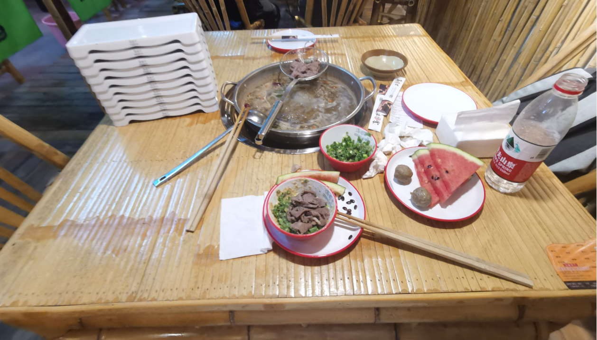
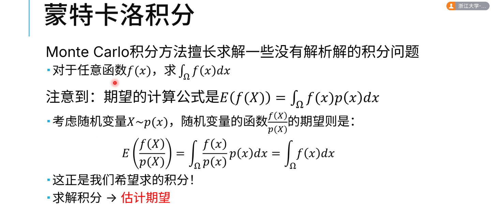
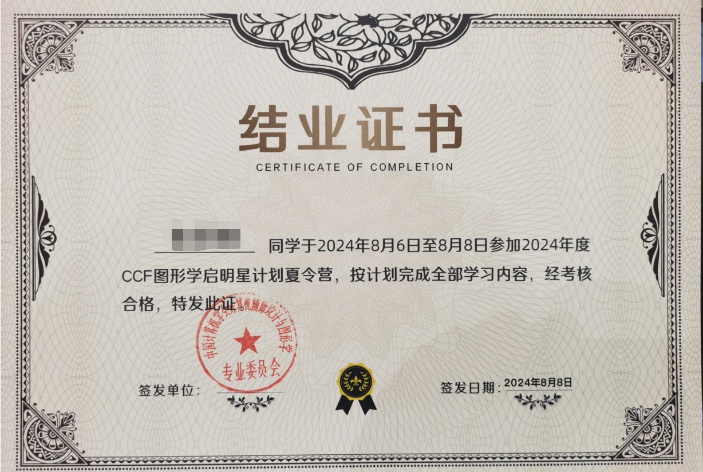

# 2024 CGPC图形学启明星计划夏令营 游记

一次十分难忘且有意义的夏令营，遂记录。

## 1. Background

先说说个人背景吧，本人大三，读研，未来准备从事图形学渲染或游戏引擎方面的工作。学习了GAMES101和202，用OpenGL实现过一个光栅化渲染器，并且在渲染器中实现了202课程提到的大概30%的渲染算法。

这次夏令营主要面向大一和大二，而我作为大三老同志很幸运地拿到了参加的机会。印象里，大三同学大概占10%。

## 2. Before Camp

夏令营的消息是在GAMES官方微信公众号上看到的，但通知上写的是面向大一大二，并且当时我还在为保研而焦虑，遂没有报名。后来，同学院的大一学弟提醒我，Q群内的管理说高年级同学也可以先报名。于是，我就报名参加了测验，后来运气很好地拿到了参加资格（大概）。

先说说这个测验吧，根据助教所说，这是一个类似于合格性测验的东西，确保参加者有基础的代码编写能力。考察内容其实就是写一些基础的数据结构或者算法，比如BVH、KDTree、光线求交算法。时间提供了几周，网上资料也很充足，代码能力合格就能通过，而剩下的就看主办方筛选了。

确定能参加后，发现夏令营的时间和NeurIPS的Rebuttal时间撞了，还好小伙伴和导师给力，正常参加应该没什么问题。

## 3. Day-1

我提前了两天到了杭州，原本打算旅个游的，后来发现杭州天气近40°C，根本不适合户外活动。期间，ACM队友金神还从老家海宁跑到杭州来一起玩，结果吃了个午饭，去浙大逛了20分钟，就原地解散了（太热了！）。感觉他奔波的时间比我们在一起玩的时间还长。

不得不提的一点就是，浙大紫金港附近餐厅真的好多啊！我在到杭州第一天晚上，就一个人跑到某自助火锅店，吃了一晚上的牛肉（听说孤独的最高境界是，一个人吃火锅）。最后吃完，肚子特别难受，缓了一个多小时才缓过来，以后还是不要这么吃这么多了！然后我一定要强烈推荐一家店 —— **春家**，这家店便宜好吃，人均60就可以吃到非常好吃的美食！并且非常饱！

> 单人吃的牛肉自助，盘子已经被收走过了一次。一个人吃了好多好多······

## 4. Day0

整个夏令营非常的高效和轻量化，基本上没有任何的手续或者流程，从头到尾就是听讲座、上课、和大佬交流，这一点让我非常地喜欢。

听说去年的夏令营，知识点涵盖图形学的各个领域。但或许听课反响不太好，所以今年夏令营就把重心放在了渲染领域上，从离线渲染、实时渲染、神经渲染三个角度授课。

接下来就是非常 *流水账* 的讲座/课程总结了，大概讲一下每个讲座/课程提到的内容，或许还有一些我的锐评（逃）。

如果想看我关于这次夏令营课程的完整笔记内容，可以直接访问 [我的Github仓库](https://github.com/YXHXianYu/CG-Notes/blob/main/CGPC2024/Notes.md)，里面包含了我的所有笔记和我听讲中遇到的知识性问题。

## 5. Day1

夏令营是在浙大紫金港国际饭店举办的，说实话，场地比较拥挤，是一个长条形状的会议室。每排座位有9个，大概排了15排左右，并且座位前后没有高低差。这导致后面的同学基本上没法看到PPT（我坐在第四排，这一排其实就已经会被前面的人挡住视线了）。但好在报告和课程都提供了在线的腾讯会议！这一点很不错，所以我全程用平板看PPT，截图也很方便。（为什么不用电脑呢，因为archlinux + hyprland跑腾讯会议，腾讯会议会直接把整个桌面环境炸掉）

在简短的开营仪式后，第一个Topic是鲍虎军老师带来的“全息数字人”报告（因为分辨称呼过于麻烦，所以我全部叫“老师”了）。报告提到了有关三维重建、NeRF、全息数字人等技术。这个报告，我其实并没有特别深的体会，大概因为我从来没有学习过所需的基础知识吧。不过，最后关于4K4D的Demo还满酷的。

第二个Topic是刘利刚老师的“从PBR到基于数据的合成”报告。这个报告对计算机图形学的三大问题做了一个介绍，从建模，到渲染，再到模拟计算。之后，也对近几年的NeRF、可微渲染、3DGS做了一些简短的介绍。整个报告中，我印象最深刻的，就是关于 **GAMES303 —— 离线渲染课程的饼！**听说是已经在筹备中，年度番剧终于要更新了！期待！（咳咳）话说回来，刘利刚老师说的还是不错的，整个报告结构清晰，听完能对图形学渲染领域有一个大概的了解。

时间到了中午。午餐是统一的盒饭，味道中规中矩，最贴心的就是给了垫桌子的报纸！而且报纸很大很厚，可以确保吃午饭的时候不会弄脏电脑和桌子，很不错。

接着是第三个Topic。这个Topic比较特殊，是一个时长约一个半小时的Fast-forward，内容大概就是：国内一部分从事图形学研究的老师，分别录制一段2-3分钟的视频，对自己的实验室、研究领域和工作做一个介绍。（听说灵感来源于Siggraph的Fast-forward）说实话，这部分听起来非常坐牢！我思考了一下，核心原因大概是因为：我基本上对图形学科研没有什么了解，听不懂老师们的介绍。

我思考了一下，主办方应该是这么想的：这个Fast-forward可以让大一大二的同学有机会了解国内的各个实验室。如果感兴趣的话，也可以直接去联系对应的老师和实验室，进组打工。因为大二同学毕竟还有一年就要考虑保研了，如果能提前进组的话，帮助还是非常大的！

随后，便是我最喜欢的第四个Topic！来自徐昆老师的离线渲染课程 —— 光线追踪算法原理。这部分难度比较大，主要涵盖了：概率论、蒙特卡洛积分、路径追踪、以及渲染方法前沿。我最惊喜的就是，这个Topic中许多概念我都是第一次听说，但是大部分内容都一次性全部都听懂了（没听懂的也做了标记），比如MIS以及各类路径追踪优化方法。我在这一个半小时的课程中，甚至没有走神过，真是太爽了！

在课后的交流环节中，听徐昆老师说，国内大部分做渲染的老师，都参加了这次夏令营。如果我去年就知道、并且来参加这个夏令营就好了，一整个夏令营的老师全是陶瓷目标（逃）。

之后是第五个和第六个Topic，分别是腾讯和网易雷火的大佬做报告。这两个Topic没什么特别的感受，感觉有点类似招聘大会。

随后，Day1就结束了。因为Day2还有离线渲染的第二个课程，所以晚上在酒店把课上没听懂的缺漏都补了一下。

## 6. Day2

Day2的第一个Topic是王贝贝老师带来的离线渲染2 —— 真实感材质建模。这节课主要介绍了目前常用的材质模型（也就是BRDF项），涵盖测量模型、BlinnPhong模型、微表面模型等等。王贝贝老师的课程也是非常优秀，笔记记了好几页，全程几乎没有走神过。

第二个Topic是由GAMES104主讲人、不鸣科技创始人 —— 王希老师 带来的报告！属于是线下学术追星了，本来想上去要个合影，后来看发现全程王希老师都很忙，就没有去打扰。不过最后提问环节，成功地和王希老师互动了几次，非常地开心！

报告主要讲了目前实时渲染的GI方法、Lumen、ReSTIR这三个部分，内容很类似 [GAMES104在知乎上的这篇文章](https://zhuanlan.zhihu.com/p/643337359)。在最后的锐评环节，听王希老师说，目前图形学渲染的课题确实有难度，因此某位大神近期甚至在研究波动光学（笑死）。

还有一个很精彩的是课后的面对面交流环节，一位助教大神向王希老师提了好多问题，王希老师也都做出了很深刻的解答，从Nanite，到游戏引擎架构选型，再到脚本技术选型。听说了很多故事，比如如果一些Unity项目对性能要求高，那么企业会直接向Unity买源码，然后找一批精锐直接去改Unity的底层；此外，各个引擎有着不同的技术路线，所以很难说某个引擎比其他引擎强力，只能说各有各的特点吧。

不过比较遗憾的是，王希老师没有聊到不鸣科技招聘相关的事情，而其他企业基本上或多或少提了招聘的事。如果未来有机会的话，还是非常希望能去相关企业跟大佬共事和学习。不过我目前对图形学的了解只能算入门，而游戏引擎连入门都算不上，慢慢学吧！

第三个Topic是光线云的王锐老师带来的“云原生实时渲染引擎”。这部分知识型的内容相对较少，所以听起来其实比较枯燥。其实相比公司的业务，我更愿意了解一下云渲染的技术细节，比如云渲染和普通实时渲染在技术实现上有哪些区别。（叠甲，这只是一个相对于方法论更喜欢听具体算法的人的想法）

第四个Topic是实时渲染，也是由王锐老师带来的。这节课比较特殊，主要聚焦在渲染管线和图形API上，介绍了一下渲染管线和图形API的发展历史。

第五个Topic是由王璐老师带来的实时渲染2。这节课感觉和GAMES202的重合比较大，我基本上都掌握了，所以对我个人而言，听上去也比较枯燥。后面听着听着就去学rust了（逃，对不起老师）。

第六个Topic是元象科技带来的技术报告，主要讲解了他们企业目前正在做的LBVR —— 基于位置的虚拟现实。翻译一下，就是各类VR线下体验店，听上去还是非常意思的，可惜只在深圳有体验店。

## 7. Day3

夏令营怎么这么快就要结束了！时间过的好快。

Day3的第一个Topic是由霍宇驰老师带来的神经渲染。这个Topic是神经渲染的技术前沿介绍，听起来有点坐牢，原因和之前一样 —— 听不懂。（我推断，是由于一位老师没空，所以Day3的两个Topic调换了顺序，导致听起来效果不太好）

第二个Topic是于涛老师带来的神经渲染基本算法介绍。这部分课程的体验也非常不错，从数学基础开始，介绍了NeRF和3DGS的技术细节。于涛老师的课程也很优秀，逻辑非常清晰，全程不走神！听完这节课，我就基本上了解NeRF和3DGS的大致算法，甚至有自信自己从零实现一个3DGS的渲染器（在GPT的帮助下）。

两天半的夏令营转瞬便逝。随后，便是闭营仪式啦！闭营仪式也一如既往地高效，没有什么领导发言环节，给每位同学发了结课证书，接着，就结束了。（这辈子第一次参加效率这么高的活动，很喜欢，也有点小震撼）

## 8. Summary

总的来说，这次夏令营真的给了我一个非常难忘的体验，如果之后允许的话，真的希望能再次参加！（不过大四肯定来不了吧！不知道有没有机会以助教身份参加）

然后，就说说个人的收获吧，最重要的就是理解了离线渲染（路径追踪、材质）和神经渲染（NeRF、3DGS）的思路；此外呢，对目前国内图形学的研究现状有了个认识，但其实更准确地说法是，知道了国内许多研究图形学的老师和实验室（毕竟前沿研究大部分没怎么听懂，只是觉得很厉害）；还有最重要的 —— 学术追星（划掉），见到了许多大佬，和大佬面对面交谈的时候，也知道了很多故事和方法论。

最后，还是非常感谢GAMES举办的这个夏令营！因为之前有听闻ACM相关比赛的筹备，所以知道举办这么一个活动还是非常难的，需要付出非常多的时间和精力，从拉赞助、定场地，到邀请老师、组织学生，感谢这么多老师用爱发电。

我很高兴能遇到图形学，也惊喜于图形学能有这么一个环境，这真是太幸福了！
