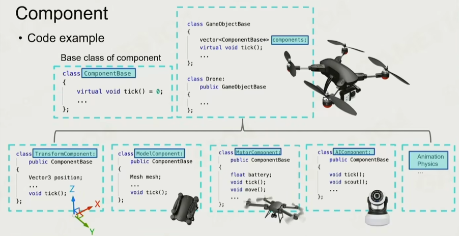
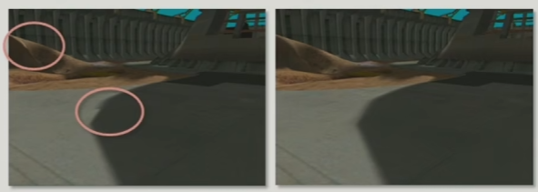
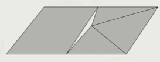
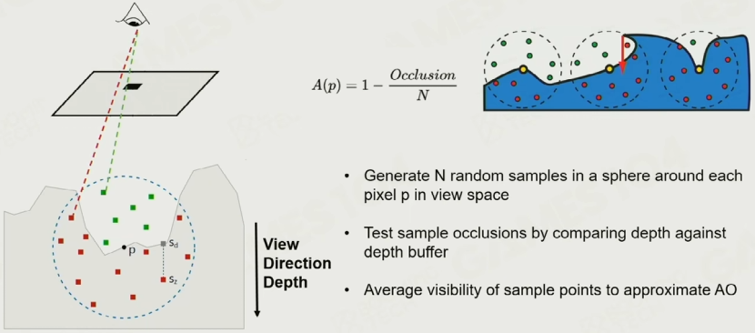
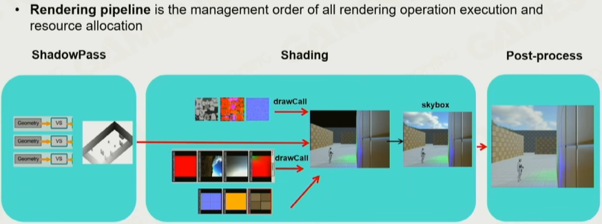

# GAMES104 (Chap1-7)

## 1. 游戏引擎导论

* History of Game Engine

* What's Game Engine

  * Technology Foundation

  * Productivity Tools

  * Art of Complexity

    > Update the Engine on the Fly

* 游戏引擎的开发非常类似操作系统

* How to Study

  * GAMES104只讲Main Road，具体细节点到为止

* Sections List

  * Basic Elements
    * unity/unreal的源码要从哪里开始读？（太酷啦！！！）
  * Rendering
  * Animation
  * Physics
  * Gameplay
    * Event System
    * Scripts System
    * Graph Driven
  * Misc. Systems
    * Effects
    * Navigation
    * Camera
  * Tool set
    * C++ Reflection
    * Data Schema
  * Online Gaming
  * Advanced Technology

## 2. Layered Architecture of Game Engine

### 2.1 Overview

* Tool Layer: Chain of Editors
* Function Layer: Rendering, Animation, Physics, Camera, etc.
* Resource Layer: Data and Files
* Core Layer: Thread Pool, Memory Pool, Mathematics
* Platform Layer: OS, File Systems, Input Devices, Graphics API

### 2.2 An Example

* Resource
  * How to Access Resource
    * 需要将不同格式的文件import进引擎，并且简化不必要的信息，只保留需要的信息，import成一个高效格式
    * 比如将贴图文件直接处理成GPU可读的格式
    * Asset: file that is imported
    * GUID: Globally Unique Identifier
  * Runtime Asset Manager
    * Manage all asset life cycle
* Function
  * How to Make the World Alive
  * Dive into Ticks
    * 
    * first **tickLogic**, then **tickRender**
  * Heavy-duty Hotchpotch
  * Multi-Threading
* Core
  * Math Library
    * 特点：追求效率并且允许误差
    * 结果：用各种技巧来优化
    * SIMD: Single Instruction, Multiple Data
      * CPU提供的并行计算功能，一条指令多次计算
  * Data Structure and Containers
  * Memory Management
    * 目标：
      * Put data together
      * Access data in order
      * Allocate and de-allocate as a block
* Platform
  * File system
  * Render Hardware Interface (RHI)
  * Other Hardware Interface...
* Tool
  * Level Editor
  * Logical Editor
  * Shader Editor
  * Animation Editor
  * UI Editor
  * Asset Conditioning Pipeline: A variety of Importer and Exporter
* 最佳实践
  * 越底层的代码越不要改
  * 新需求，先考虑需求属于哪个层
  * 只允许上层调下层，绝对不允许下层调上层
* Takeaways
  * 游戏引擎是分层架构
  * 越底层的代码越稳定，越高层的代码越动态
  * 游戏引擎是以tick为最小时间单位

## 3. How to Build a Game World

* Everything is a Game Object (GO)
  * Dynamic Game Objects
  * Static Game Objects
  * Environments
  * Other Game Objects, e.g. trigger
* How to describe a Game Object
  * OOP
    * Property
    * Behavior
  * Component Base
    * 组合优于继承！
    * 
* Component-based Tick
  * 先tick每种不同的Component
  * 再tick不同的Object
  * 
  * 流水线，批处理，同类Component内存塞一起，效率高
* Events
  * 比如炸弹爆炸，Hardcode vs Events
    * Hardcode：在爆炸处理中写上每种不同其他GO的类型，并且根据类型判断效果
    * Events：`sendExplodeEvent(go_id)`
  * Event System的作用：解耦合！
* How to Manage Game Objects
  * Scene Management
    * 每个物体都可能会和其他所有物体交互，n方问题
    * 
    * No division
    * Divided by grid
    * Octree
      * 比如当前节点物体过多，则继续划分；否则停止划分
    * 其他方法
      * 
    * 空间上的数据管理，是场景管理的核心
* Takeaways
  * 游戏中所有物体都是一个Game Object
  * 每个Game Object是以Component-based way来描述的
  * GO的状态是以tick loops来更新的
  * GO之间是通过Event Mechanism来交互的
  * 场景中的GO被以一些很高效的算法组织起来
* 其他问题
  * GO Bindings
    * 比如人在车上，人跟着车动。那么车就要先tick，人再tick（时序！）
  * Event的先后
    * 比如replay，通常只录制玩家的输入，用输入回放。那万一有并行输入，或者并行处理，那么要如何确保结果一致呢？
    * 引入“邮局”
    * 代码中的PreTick和PostTick就是为了解决时序性的问题
  * Component Dependencies
    * 循环依赖等

## 4. Rendering on Game Engine

* Challenges on Game Rendering
  * 数十种算法同时作用在一个系统内
  * 需要适配现代硬件
  * 帧率要求越来越高，画质同时也要求越来越高
  * 不能吃满CPU
* Rendering on Game Engine
  * A **heavily optimized practical software** framework
* Outline of Rendering
  1. Basics of Game Rendering
  2. Materials, Shaders and Lighting
  3. Special Rendering
  4. Pipeline
* Rendering Pipeline and Data
  * 
  * Projection and Rasterization
  * Shading
  * Texture Sampling

### 4.1 GPU and Hardware

* GPU
  * SIMD (Single Instruction Multiple Data)
    * e.g. 一个指令，4次加法
  * SIMT (Single Instruction Multiple Threads)
    * e.g. 一个指令，数百次4次加法
* GPU Architecture
  * GPC, Graphics Processing Cluster
  * SFU (Special Function Unit)，用于处理一些特殊函数 (比如sin)
    * 所以在shader中，要少调用特殊函数
  * Tenser Core
  * Arti Core
* Data Flow from CPU to GPU
  * 最佳实践
    * **尽可能保证数据单向传输，只从CPU to GPU**
    * **尽可能保证Cache命中率**
      * 一次加法1个clock，一次内存查询约100次clock
      * 

* Application performance is usually limited by
  * Memory Bounds
  * ALU Bounds
  * TMU (Texture Mapping Unit) Bounds
  * BW (Bandwidth) Bounds
* Other State-of-Art Architectures
  * UMA, Uniform Memory Access
    * 所有处理器通过一个共享的物理内存访问，并拥有相同的访问时延
  * Tile-Based GPUs
    * 将画面分割成一个个小块

### 4.2 Renderable

* Mesh Render Component
  * Game Object无法渲染，需要一个特殊的Component才能被渲染，这就是Mesh Render Component
  * 行业俗称Renderable
* Mesh Primitive
  * Vertex Data: Position, UV (, Normal)
  * Index Data
  * Material
  * Texture: Normal, Albedo, Metallic, etc...
  * Shader

### 4.3 Render Objects in Engine

* How to display different textures on a single model
  * 
  * **Submesh**，每个submesh只需要有一个bais，然后去公共vertex data查自己的vertex data
* To reduce wasting of resource
  * **Resource Pool**
  * 相同的资源归类到一起
* **Instance**
  * Instance vs Definition, 类似 Process vs Program
* GPU Batch Rendering

### 4.4 Visibility Culling

* 可见性裁剪，去除不在视锥内的物体，减少渲染开销
* Bounding Box
  * Sphere，效率最高
  * AABB (Axis-Aligned Bounding Box)，效率其次
  * OBB (Object Bounding Box)
  * Convex Hull
* BVH, Bound Volume Hierarchy
  * 最常用的用于管理Object的数据结构
* PVS, Potential Visibility Set
  * John Carmark发明的
  * 用BSP-Tree把房间划分开，并且单独对每个房间进行编号，在一个房间内，只渲染出这个房间只能看到的其他房间的物体
  * 
  * 思想：可以用PVS来划分区域，更高效
* Texture Compression
  * Block Compression，将Texture分为一个个块，取块内最鲜艳和最淡的颜色，假设块内颜色都是这两个颜色的插值
  * Common block-based compression format
    * On PC, BC7 (modern)  or DXTC (old) formats
    * On mobile, ASTC (modern) or ETC / PVRTC (old) formats

### 4.5 Authoring Tools of Modeling

* Modeling
  * Polymodeling: MAX, MAYA, Blender
  * Sculpting: Z-Brush
  * Scanning
  * Procedural Modeling

### 4.6 Cluster-Based Mesh Pipeline

* 因为Sculpting Tools Create Infinite Details，所以我们需要同时提升渲染管线
* GPU-Driven Rendering Pipeline (2015)
* Geometry Rendering Pipeline Architecture (2021)
  * 在GPU中去细化Mesh，生成更多的几何（还可以根据相机距离生成不同精细度的模型）
  * 

### 4.7 Take Away

1. 游戏引擎设计，深度依赖于硬件架构设计
2. 渲染中，核心是处理Mesh/模型/材质之间数据的关系
3. 使用Culling Algorithm尽可能少的处理物体
4. 数据运算从CPU转移到GPU

## 5. Rendering - Lighting, Materials and Shaders

* The Rendering Equation
  * 
  * 
* The 1st Challenge: Irradiance
  * 1a Visibility to Lights: Shadow
  * 1b Light Source Complexity: 点光源，平行光，甚至面光源
* The 2nd Challenge: How to do Integral Efficiently on Hardware
* The 3rd Challenge: Any matter will be light source

### 5.1 Starting from Simple

* Light = Main Light + Ambient Light + Environment Map
* Blinn-Phong Materials
  * Light = Diffuse + Ambient + Specular
  * Problems
    * Not energy conservative
    * Hard to implement complex material
      * 所有材质实现起来都像塑料
* Shadow Map
  * Shadow Map采样率与Camera采样率不一致，就会产生alias
    * 精度不够
    * 导致：自遮挡，etc.
* Basic Shading Solution
  * Diffuse -> No. 1b
  * Ambient -> No. 3
  * Blinn-Phong -> No. 2
  * Shadow Map -> No. 1

### 5.2 Pre-computed Global Illumination

* 空间换时间，预计算（烘焙）
* Spherical Harmonics
  * 我们在图形学大作业中要实现Spherical Harmonics！
* SH Lightmap
  * Pros
    * Very efficient on runtime
    * Bake a lot of fine detail of GI on environment
  * Cons
    * Long and expensive precomputation (lightmap farm)
    * Only can handle static scene and static light
    * Storage cost on package on GPU
  * Thoughts
    * 空间换时间
    * 3D转换为2D
  * 【问题：为什么不直接用一张贴图把某个位置的全局光照颜色记录下来？而是要用复杂的SH？】
* Light Probe
  * 
  * 生产中，通常使用自动化生成Light Probe，艺术家会爱死你！
  * 一种特殊的Probe：Reflection Probe
    * 精度高，密度少
  * Light Probe + Reflection Probe
    * Pros
      * Very efficient on runtime
      * Can be applied to both static and dynamic objects
      * Handle both diffuse and specular shading
    * Cons
      * A bunch of SH light probes need some precomputation
      * Can not handle fine detail of GI. I.e, soft shadow on overlapped structures（效果比不上lightmap）

### 5.3 Physical-Based Material

* Microfacet Theory
  * 假设：金属表面的法线聚集，塑料表面的法线分散
* BRDF Model Based on Microfacet
  * 
  * DFG中的D，Normal Distribution Function
    * 下图中使用了GGX微表面分布模型，描述法线的分布
    * 
    * $\alpha$ roughness，表达了microfacet中法线分布的集中程度
  * DFG中的G，Geometric Attenuation Term (Self-Shadowing)
    * 几何遮蔽项，描述光线的自遮挡
    * 
  * DFG中的F，Fresnel Equation
    * Fresnel项，描述反射光强度如何随着光线的入射角而变化
    * 
* Physical Measured Material
  * MERL BRDF Database of measured materials
  * 这个数据库包含了不同材质在PBR中的参数，用于艺术家参考
* Disney Principled BRDF
  * Intuitive rather then physical parameters should be used
  * There should be as few parameters as possible
  * Parameters should be zero to one over their plausible range
  * Parameters should be allowed to be pushed beyond their plausible range where it makes sense
  * All combinations of parameters should be as robust and plausible as possible
* Disney Principle Material Parameters
  * 

#### 5.3.1 PBR Specular Glossiness (SG)

* Material = Diffuse + Specular + Glossiness
* 
* 缺点：艺术家参数设置不优，则材质可能会爆炸

#### 5.3.2 PBR Metallic Roughness (MR)

* Material = Base Color + Roughness + Metallic
* 
* 对SG做了一套封装，避免参数设置错误导致的材质爆炸

#### 5.3.3 Comparison

* 

### 5.4 Image-Based Lighting

* Basic idea of IBL
* Diffuse Irradiance Map
  * 将一个点按照它的法线对应的半圆的环境光进行积分，将结果存入Diffuse Irradiance Map，在渲染diffuse时直接查贴图得
  * 
* Specular Approximation
  * 对于The Lighting Term
    * 将不同roughness对应的specular的值，存入不同的Map（直接基于GPU的Mipmap）
    * 
  * 对于BRDF Term
    * 另一个表
    * 
* 结合在一起，可以得到一种GI的优秀效果
  * 
* 【为什么不直接把渲染结果弄进贴图？】
  * 因为这种方法依赖特定视角（比如对于specular物体而言）

### 5.5 Classic Shadow Solution

* Cascade Shadow
  * 近处做高采样率shadowmap，远处做低采样率shadowmap
  * 
  * 问题：不同层级之间要做插值，否则会出现这种情况：
    * 
* Soft Shadow
  * PCSS
  * Variance Soft Shadow Map

### 5.6 Summary of Popular AAA Rendering

* Light: Lightmap + Lightprobe
* Material: PBR (with SG and MR) + IBL
* Shadow: Cascade Shadow + VSSM
* 十年前的游戏引擎都是基于这些技术

### 5.7 Moving Wave of High Quality

* Real-Time Ray-Tracing on GPU
* Real-Time GI
  * Screen-space GI
  * SDF Based GI
  * Voxel-Based GI
  * RTX GI
* More Complex Material Model
* Virtual Shadow Map
  * Unreal5提出的
  * 用一张巨大的且划分为一格一格的Shadow Map去储存整个场景的Shadow Map，在查询时直接查询对应部分
  * 【那光源不就不能移动了吗？草】

### 5.8 Shader Management

* Shader太多了，3A游戏一个页面有几千个Shader，Shader太多了！
* 实践中，我们会创建一个 **Uber Shader**，再用宏定义分出各种不同的分支，对于每种分支，都编译出不同的Shader Code，交给GPU执行
  * 吐槽：难怪很多3A需要在游戏开始前编译shader
  * 某游戏：165 Uber shader生成了75536个shaders
* Cross Platform Shader Compile
  * 

## 6. Rendering - the Beautiful Mother Nature

* 

### 6.1 Terrain

* How to make Terrain
* Heightfield (Height Map)
  * Adaptive Mesh Tessellation
    * 
  * FOV越小，每个三角形越大 —— LOD需要考虑FOV
* Triangle-Based Subdivision
  * 永远在等腰直角三角形的最长边中点切一刀，就可以得到两个新的等腰直角三角形
  * 
  * T-Junctions
    * 错误情况：
    * 正确处理：
* QuadTree-Based Subdivision
  * 
  * T-Junctions among Quad Grids
    * 
    * Sol: Stitching
    * 多了中间点，那么就把中间点stitch到其他相邻点
* Triangulated Irregular Network (TIN)
  * 用不规则的三角形来表达地形
* GPU-Based Tessellation
  * **Mesh Shader**
* Real-Time Deformable Terrain
  * 可以基于Mesh Shader实现

### 6.2 Non-Heightfield Terrain

* Dig a hole on the terrain
  * 可以在vertex shader中设置vertex为nan，然后再插入一个隧道的柱状模型
* Marching Cubes
* Make AAA as Flexible as Minecraft??? :-)

### 6.3 Paint Terrain Materials

* Simple Texture Splatting
  * α混合，不符合现实观察
  * 
* Advanced Texture Splatting
  * Height Maps，考虑Height Maps
  * 
* Advanced Texture Splatting - Biased
  * Height Maps + α + Bias，若Height插值在Bias以内，则用α混合
* Sampling from Material Texture Array
  * 问题：游戏中材质非常非常多，怎么办？
  * 用一个Array管理
* Parallax and Displacement Mapping
  * 
  * Bump Mapping: 改变法线
  * Parallax Mapping: 改变UV
  * Displace Mapping: 改变顶点位置
* Expensive Material Blending
  * 对Terrain采样，一个像素可能要插值十几次（多种texture混合），开销很大
* Virtual Texture
  * 类似Virtual Memory，将主要的Texture全部存在硬盘中，建立一个Page Table，减少显存开销
  * 
  * 
* Floating-point Precision Error
  * 
  * Sol: **Camera-Relative Rendering**
    * 使用摄像机坐标系，即摄像机位于(0, 0, 0)
    * Unity和Unreal均使用这种方法

### 6.4 Other world elements (rocks, trees, grass)

* Tree Rendering
  * Speedtree：一个Tree Rendering插件就可以卖几十万
* Decorator Rendering
  * 草
* Road and Decals Rendering
  * Decals：fps游戏中的枪眼就是一种decal

### 6.5 Procedure Terrain Creation

* 略

### 6.6 Sky and Atmosphere

* Analytic Atmosphere Appearance Modeling
  * 
* Participating Media
  * Radiative Transfer Equation (RTE)
    * 
    * 对RTE进行积分，则可以得到VRE
  * Volume Rendering Equation (VRE)
    * 
    * VRE有两个关键参数：
      * Transmittance，通透度，有多少光能直接透过介质到达摄像机
      * Scattering，散射度，介质中经过散射，有多少其他粒子贡献的光到达摄像机

* Real Physics in Atmosphere
  * Rayleigh Scattering
    * 特点：对于越短的波长，粒子散射越强
  * Mie Scattering
    * 特点：对波长不敏感
* **Rayleigh Scattering**
  * 
  * λ：波长
  * θ：极坐标的角度
  * h：海拔
  * 适用于：**天空**
* **Mie Scattering**
  * 
  * 适用于：**雾**、**光晕**
* Variant Air Molecules Absorption
* Single Scattering vs. Multi Scattering
  * 
  * 
* **Ray Marching**
  * 作用：用于计算一条路径上的积分
* Precomputed Atmospheric Scattering
  * [Online Demo](https://ebruneton.github.io/precomputed_atmospheric_scattering/demo.html)
  * Trasmittance
    * 
  * Scattering
    * 
  * Multi Scattering LUT
    * 
  * Dice的效果
    * 
* Production Friendly Quick Sky and Atmosphere Rendering
  * Unreal 5引入
  * 假设：空气中每个分子是各向同性的，然后只算一次Single Scattering，然后通过级数计算Multi Scattering
  * 假设2：海拔高度固定
  * 假设3：太阳位置固定
  * 

### 6.7 Cloud

* 
* Mesh-Based Cloud Modeling
  * 用Mesh实现Cloud
* Billiboard Cloud
  * 用插片实现云
* Volumetric Cloud Modeling
  * Weather Texture，用[0, 1]表示云的厚度
  * Noise Function
    * 
    * Perlin Noise
    * Worley Noise
      * 近亲：Voronoi
  * Rendering Cloud by Ray Marching
    * 

## 7. Rendering - Render Pipeline, Post-process and Everything

### 7.1 Ambient Occlusion

* Precomputed AO
* Screen Space Ambient Occlusion (SSAO)
  * 原始公式
    * 
    * 光不从四面八方来，所以不应该是个球！
  * SSAO+
    * 采半圆
    * 
* Horizon-Based Ambient Occlusion (HBAO)
  * 在一个半圆内找一个最高的倾角，通过这个最高的倾角来计算AO
* Ground Truth Based Ambient Occlusion (GTAO)
  * 
* Ray-tracing Ambient Occlusion

### 7.2 Fog

* Depth Fog
  * 根据深度设置fog（Minecraft默认fog就是这么实现的）
  * 
* Height Fog
  * Fog有一个最大高度
  * 
* Voxel-based Volumetric Fog
  * 现代Fog的实现方法之一
  * 和第六节的大气计算方法极其类似，老师说大气计算方法看懂，这也就也能看懂

### 7.3 Anti-aliasing

* Reason of Aliasing
  * Edge Sampling
  * Texture Sampling
  * Specular Sampling
* Super-Sample AA (SSAA) and Multi-Sample AA (MSAA)
  * SSAA对整体超采样
  * MSAA只对边缘超采样
* Fast Approximate Anti-aliasing (FXAA)
  * 步骤
    1. 用一个十字滤波提取出图像的Edge
       * 
    2. 计算相邻的水平像素差距大，还是竖直像素差距大，再计算哪个像素差距大，绑定这两个像素
       * 
    3. 寻找匹配当前像素差异的边（Edge Searching），找边的两个端点
       * 
    4. 根据相似三角形，计算当前像素AA后的颜色
       * 
  * Result
    * 
* Temporal Anti-aliasing
  * 基于时序的AA

### 7.4 Post-process

* 

#### 7.4.1 Bloom Effect

* 步骤
  * 根据阈值取出颜色
  * Gaussian Blur
    * 如果要大光晕，那么可以用 Pyramid Guassian Blur
* 效果图
  * 
  * 

#### 7.4.2 Tone Mapping

* 把大亮度范围映射到小亮度范围
  * Map the wide range of high dynamic range (HDR) colors into standard dynamic range
* Filmic
  * 
* ACES，Academy Color Encoding System
  * 新的Tone Mapping算法

#### 7.4.3 Color Grading

* 用于调颜色
* 
* 每种颜色效果，可以用一个3D LUT来表达
* Artist特别喜欢的功能
  * Photoshop和3D LUT Creator这两个软件都可以导出3D LUT

### 7.5 Render Pipeline

* What we learned about rendering
  * 1/4: Meshes, Culling
  * 2/4: Light, Shadow, GI, PBR Materials
  * 3/4: Terrain, Sky and Cloud
  * 4/4: AO, Fog, AA, Post-process
* Rendering Order
  * 按什么顺序渲染？

#### 7.5.1 Forward Rendering

* 
* 先渲染非透明物体，再渲染透明物体（由远及近）

#### 7.5.2 Deferred Rendering

* 
* 优点：更方便的支持多光源
* 缺点：对缓存IO要求高（移动端，发热严重）

#### 7.5.3 Tile-based Rendering

* 将图片划分为一小块一小块，可以减少G-Buffer的IO开销
* Tile-based Rendering可以做这些优化
  * 一个小tile，可能不会同时被很多光照到，就可以使用 Light Culling
  * 一个小tile，可以得知最大和最小的深度，在culling时做优化
* 现在很多大作都开始使用Tile-based Rendering
* 注：Forward+ Rendering = Tile-based Forward Rendering
  * 对移动端非常友好

#### 7.5.4 Cluster-based Rendering

* 对Z空间的near和far直接进行切分，分为很多四棱锥
  * 
* 在Doom 2016中被使用

#### 7.5.5 Visibility Buffer

* 引入Visibility Buffer，使用V-Buffer，而不是用G-Buffer
* 在V-Buffer中，储存几何信息，而不是材质信息
* 
* 在2022年初成为趋势，目前不了解

### 7.6 Real Rendering Pipeline

* 
* Challenges
  * 在复杂的并行计算中，管理资源依赖
  * 管理大量的短生命周期资源
  * 复杂的资源状态管理
  * 新API提供的更底层的GPU功能
* Frame Graph
  * 用一个DAG来管理每个计算过程的依赖，并且让算法来自动释放资源
  * IDEA：**在工程偏向大型后，不应该依赖个人能力，而是应该创造一些自动化工具，用规则来减少错误**

### 7.7 Render to Monitor

* Screen Tearing，画面撕裂

* V-Sync 垂直同步

  * 让Frame渲染完成时，再刷新到屏幕上

* Free Sync

  * 让显示器的刷新率动态可调

  
