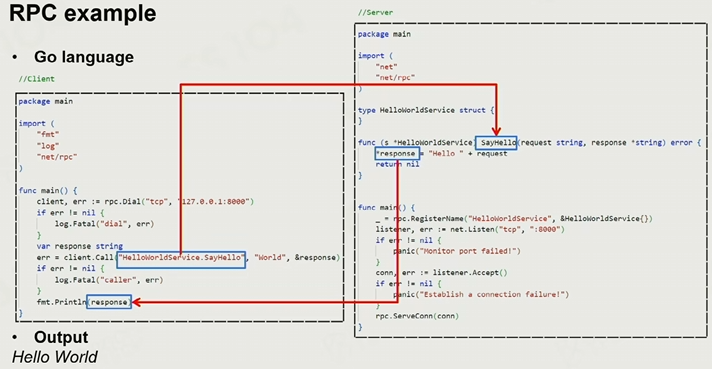
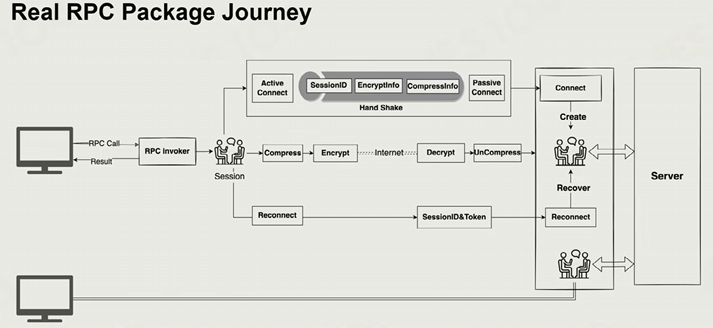
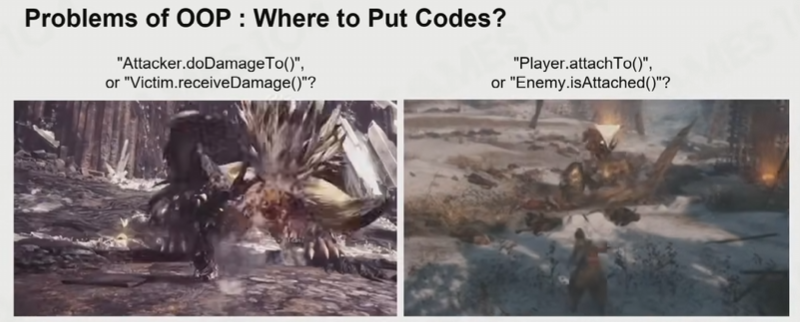
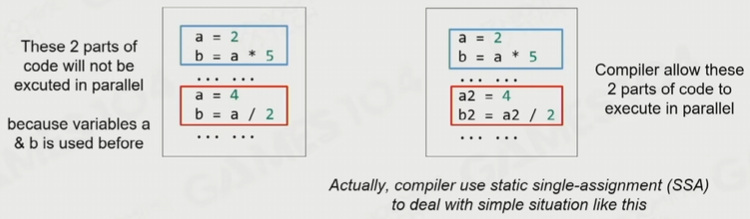
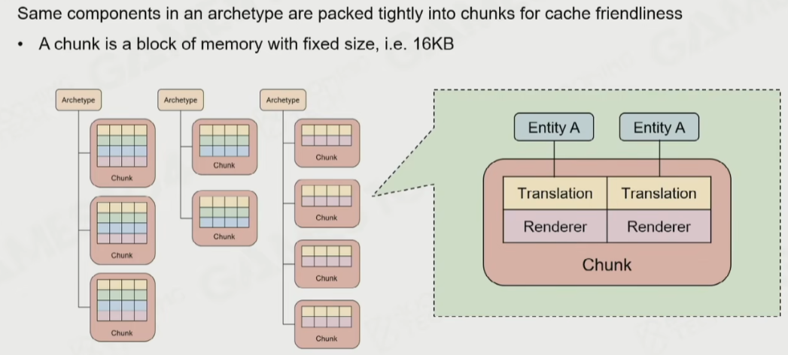
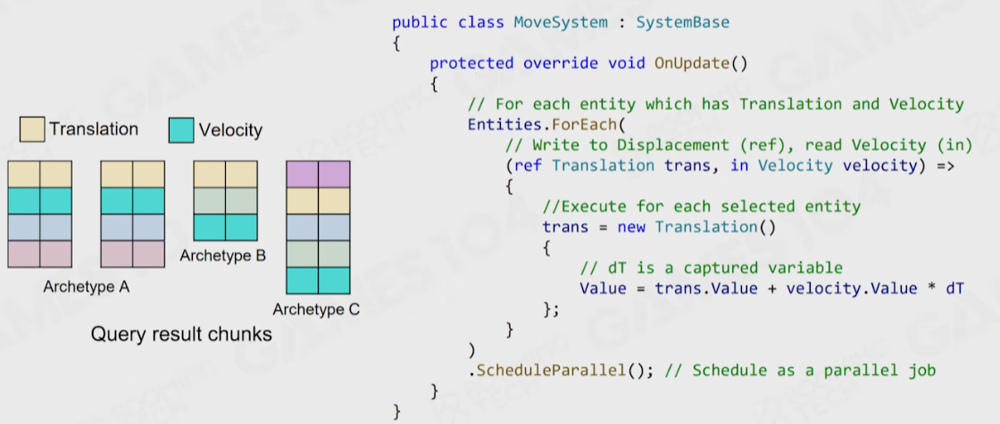
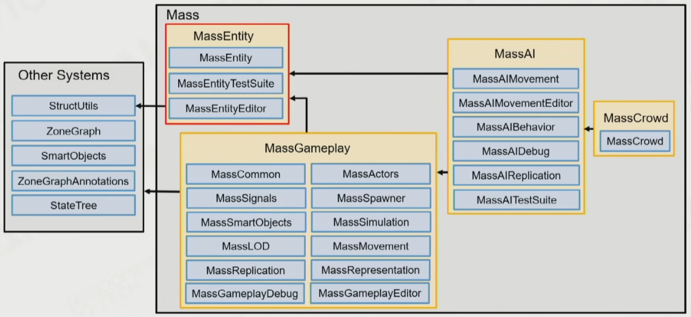

# Notes-Chap15-22

## 15. Gameplay：基础

* Gameplay的特点
  * 会和其他各个系统进行交互，影响动画、渲染、音效、控制、etc
  * 迭代速度最快的一个系统（设计师给了新想法，就需要快速修改、实现）

### 15.1 Event Mechanism

* Event Mechanism
  * 观察者模式（Publish-subscribe Pattern）
  * 三步：Event Definition、Callback Registration、Event Dispatching
* **重点：Gameplay系统通常需要和引擎本身解耦，比如用纯数据的方式定义Event，否则游戏引擎可能会做成服务某种特殊游戏类型的引擎**
* Event Definition
  * 例子：Editor创建Event类型，然后Code Generator生成C++代码，再编译、反射进Editor
  * 如何避免加速、避免编译？
    * 可以使用DLL注入，避免重新编译代码
    * 也可以使用脚本语言，比如Lua、Python
* Callback Registration
  * 例子：受伤后，就会callback受伤函数
  * 问题：对象的生命周期 和 回调函数的安全性
    * 例子：手雷爆炸的时候，对象已经被销毁了，但是回调函数还是会访问这个对象进行处理
    * 解决方案：RAII
* Event Dispatch
  * 直接派发：问题很多，比如递归调用、难以并行等
  * Event Queue：用一个Queue捕获所有需要处理的Event
    * Event Queue需要使用一个Ring Buffer
    * 也可以设计多个不同种类的Queue，比如Net Event Queue、Combat Event Queue等

### 15.2 Game Logic

* 用C++等语言写逻辑的问题
  * 编译耗时、设计师和艺术家不一定熟悉编程语言
  * 解决方案：Scripting Languages，如Lua、Python
    * 优势：崩溃影响小等等
* **问题：GameObject的生命周期，是要引擎管理，还是脚本管理呢？**
  * 在玩法复杂的游戏中，通常是由脚本管理
  * 脚本语言会提供GC系统，优势是降低编码门槛，缺点是GC开销过大（在许多重度脚本语言的游戏中，GC的开销可能会占游戏逻辑开销的1/10以上）
* Scripting System
  * 引擎调用脚本：比如Unity，可以用C#扩展Component，然后Unity会调用对应代码
  * 脚本调用引擎：把引擎看作一个SDK集
* **问题：如何实现热更新？**
  * 通常可以通过直接修改函数指针来实现
  * 然后要避免热更新的脚本把  引擎炸掉
* **问题：脚本语言效率低**
  * 解决：**JIT，Just-in-time**
* 热门的脚本语言
  * Lua
  * Python
  * C#（可以编译成字节码）

### 15.3 Visual Scripting

* 基本元素：变量、语句和表达式、控制流、函数、（类）
* 会用不同颜色的引脚，来区别不同的数据类型
  * 
* 函数 <-> 蓝图
  * 
* 可视化编程的问题
  * 代码合并很困难，无法合并图
  * 蓝图可能会非常混乱
    * 
* Visual Scripting 可以被编译成 Scripts，然后再由解释器或者VM执行

### 15.4 Character/Camera/Control (3C System)

* Character
  * 与其他系统的交互：Animation、Movement、Affects
  * 通常一个Character，会用一个状态机/ASM来表达所有动画状态，然后每个动画再辅助单独的脚本
* Control
  * 细节：辅助瞄准、震动反馈等等
* Camera
  * 细节
  * 可以调一调我的unity demo的camera系统

### 15.5 Takeaways

* 游戏逻辑太混乱，所以用Event系统简化逻辑
* 无法预先考虑所有逻辑，所以要开放scripting system
* scripting太难上手，所以提供了visual scripting

***

## 16. Gameplay：Basic AI

* Q&A环节：Event System通常会考虑events的优先级吗？
  * 可以分队列。但是在观察者模式中，不推荐这么做，因为这会让event的耦合性变高，并且不利于并行化。

* 【略！AI等以后有空再回来学吧！】

***

## 17. Gameplay: Advanced AI

* 【略！AI等以后有空再回来学吧！】

***

## 18. Online Gaming Architecture: Fundamentals

* Online Gaming的挑战
  1. 一致性：网络同步
  2. 可靠性：延迟、掉线重连
  3. 安全性：作弊、账号安全性
  4. 多样性：跨平台、热更新、不同类游戏
  5. 复杂性：高并发、高可用、高性能

### 18.1 Network Protocols

* OSI Model & TCP/IP Model
* Socket
* Protocols：TCP（连接稳定、拥塞控制等）、UDP（Connectionless、不可靠、高效）
  * 

### 18.2 Reliable UDP

* 现代游戏引擎中，并不会直接用原生态的协议，而是会对协议做改造
  * 例子：Overwatch基于UDP，实现了一个自己的稳定的、带有延迟补偿的协议
* ACK、Negative ACK、SEQ、Timeouts
* Automatic Repeat Request（ARQ）
  * 使用一个滑动窗口来控制发包的数量
  * Stop-and-Wait ARQ：Window size = 1
  * Go-Back-N ARQ：窗口内丢包了，就重发整个窗口
  * Selective Repeat ARQ：窗口内丢包了，就重发特定包
* Forward Error Correction（FEC）
  * 目标：丢包可以直接不管，不需要重发
  * FEC方法
    * XOR-FEC
      * 
      * 通过多的异或冗余packet，来复原数据
    * Reed-Solomon Codes
      * *听起来类似CRC，但好像细节不太一样*
* 

### 18.3 Clock Synchronization

* Round-Trip Time（RTT）
  * 一个packet来回的耗时
  * RTT和Ping的不同：Ping是通过ICMP协议测量的，而RTT是应用层测量的
* Network Time Protocol（NTP）
  * 算法：估算出RTT，然后根据RTT来对齐时间
  * 
* **建立连接后，第一件事就是：校准时钟**

### 18.4 RPC

* 因为直接写Socket非常痛苦，细节很多（数据对齐、端序、类型定义），所以需要一个封装好的工具 —— **RPC**
* 
* Interface Definition Language（IDL）
  * 例子：Google ProtoBuf
* RPC Stubs（RPC存根）
  * *没这么理解*
* 

### 18.5 网络架构

* 略

***

## 19. 网络游戏的进阶架构

* 略

***

## 20. Data-Oriented Programming & Job System

### 20.1 Basics

* 略，操作系统学过了

### 20.2 Parallel Framework

* Framework Type
  * Fixed Multi-thread
    * One fixed thread for each part of module (render, logic, etc)
    * 问题：木桶效应
  * Fork-Join
    * 预先申请一些work thread，专门处理一些需要大量重复计算的任务
  * Unreal Parallel Framework
    * 两类Thread：Named Thread、Worker Thread，分别处理特定模块和大量计算任务
  * Task Graph
    * 将Task和它们的Dependency建成图，然后多线程处理
  * Coroutine
    * 一个轻量化的多线程框架：一个任务执行一半时，可以让步给其他任务
    * 问题：C++没有
    * 
    * Coroutine Type
      * Stackful Coroutine
      * Stackless Coroutine
      * 【没理解透】
  * Fiber-based Job System
    * *略*
  * Job System
    * *略*

### 20.3 Programming Paradigm 编程范式

* Procedural Oriented Programming，POP

* Object-Oriented Programming，OOP
  * Problem
    1. 
    2. 继承树过于复杂，不确定方法具体在哪个父类中实现
    3. 基类过于复杂（比如Unreal的UObject就复杂至极）
    4. 性能差
    5. 可测试性，OOP的单元测试较难编写
  
* Data-Oriented Programming，DOP

  * Cache友好
    * *略，已经会了*
  * SIMD
    * 设计数据结构的时候，尽量设计可以被SIMD优化的
  * Cache选择策略 —— LRU
  * 目标：让代码和数据在内存中排列密集

* Performance-Sensitive Programming

  1. 减少顺序依赖性，例如下图

     * 

  2. False Sharing in Cache Line

     * 避免两个thread读取同一个cache line，否则会导致CPU要处理cache数据不一致，从而性能降低

  3. Branch Prediction 分支预测

     * CPU会预测分支，将分支的代码直接读入到L1 Cache中，进行加速

     * 所以如果分支执行连续的话，性能会更高

  4. Reducing Memory Dependency 减少内存依赖

     * Array of Structure vs. Structure of Array (AOS vs. SOA)
     * 性能SOA会更高，因为内存排列更紧密，可以SIMD优化

* Entity Component System（ECS）

### 20.4 Unity DOTS

* Unity DOTS（Data-Oriented Tech Stack）
  * ECS + C# Job System + Burst Compiler
* Archetype
  * Archetype指一类Component相同的Entity
* Data Layout in Archetype
  * 
* System
  * 

### 20.5 Unreal Mass Framework

* 
* 在Unreal中
  * Entity <-> Entity
  * Fragment <-> Component
  * Processor <-> System
  * Unreal和Unity一样，也有Archetype
