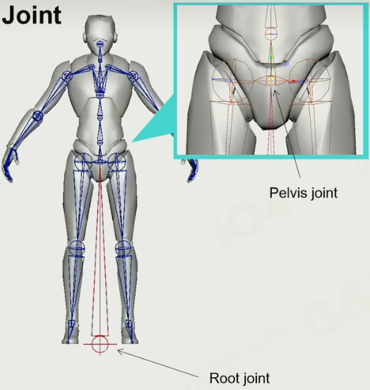
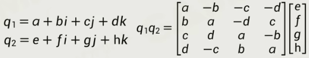
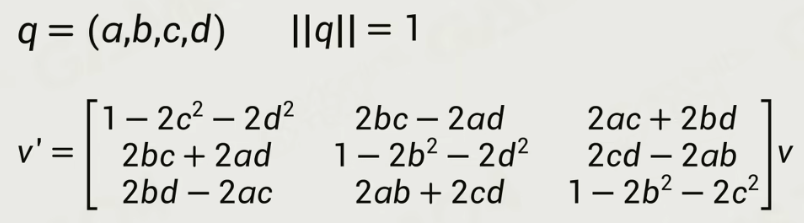
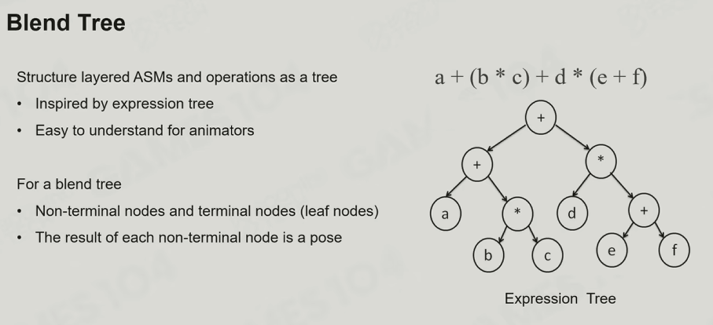

# Notes-Chap8-14

## 8. Basics of Animation Technology

* Challenges in Game Animation
  * (1/3) Interactive and dynamic animation
    * 无法预测玩家行为
  * (2/3) Real-time
  * (3/3) Realism

### 8.1 2D Animation

* Sprite Animation
  * 用贴图循环播放
  * Sprite-like Animation in pseudo-3D game
    * 
  * Sprite Animation in Modern Game
* Live2D
  * 将人物的每个身体组件拆开，通过各种变换进行组合
  * 每个组件：深度 + 控制点 + 关键帧
  * 

### 8.2 3D Animation Techniques in Games

* DoF (Degrees of Freedom)
  * 对于一个刚体来说，空间中有6个DoF
    * translation x/y/z，rotation yaw/roll/pitch
* Rigid Hierarchical Animation
  * 刚体 + 层级
* Per-vertex Animation
  * 用预处理texture来记录每个顶点随时间变化的位置
  * 适用于：旗帜、水流
* Morph Target Animation
  * 调整多个预设动画的权重，通过插值来得到最终效果
* 3D Skinned Animation
  * 骨骼驱动动画
* 2D Skinned Animation
  * 2D的骨骼驱动动画
* Physical-based Animation
  * 适用于：Ragdoll，Cloth and Fluid Simulation，IK
* Animation Content Creation
  * 如何创造Animation：手K动画，Motion Capture

### 8.3 Skinned Animation Implementation

* Step
  * 
* Different Spaces
  * Local Space ∈ Model Space ∈ World Space
  * Local Space: 骨骼的坐标系
* Skeleton for Creature
  * Category：Humanoid Skeleton，Non-humanoid Skeleton
  * 对于Humanoid Skeleton来说，Pelvis Joint在脊椎的最下方的一个骨骼上，而Root Joint在Pelvis的正下方和脚底平面上
* Joint vs. Bone
  * 
  * Joint有自由度，Bone无自由度，会被Joint决定
* Humanoid Skeleton in Real Game
  * 
* Joints for Game Play
  * Weapon Joint，Mount Joint
  * 人物拿武器、骑乘，实际上都是把另一个模型绑定在某个特殊的joint上
* Pelvis Joint 和 Root Joint
  * root joint，在跳跃和蹲下的时候都起作用
  * 
  * 
* Bind Animation for Objects
  * 两个模型绑定在一起的时候，位置和方向都要一起变（比如汽车转向，人也转向）
    * 更类似于一个卡槽，方向也要变
* Bind Pose (T-Pose vs. A-pose)
  * T-Pose的问题，肩膀被挤压，所以现在行业中更常用A-Pose
* Skeleton Pose
  * Joint Pose共有9DoFs
    * Position，Orientation，Scale

### 8.4 Math of 3D Rotation

* 2D Orientation Math

* 3D Orientation Math - Euler Angle

  * 可以绕三个不同的轴旋转，也可以绕空间中任意一个轴旋转
  * 欧拉角，公式如下
    * 
  * 欧拉角的问题
    * **Order Dependency**
      * 旋转顺序不可变，先转x再转y ≠ 先转y再转x
    * **Gimbal Lock**
    * Hard to interpolate
    * Difficult for rotation combination
    * Hard to rotate by certain axis

* 3D Orientation Math - Quaternion

  * 四元数的原理只在二维和三维空间中成立
    * 原理和 “五次及五次以上的方程没有解析解” 有关
  * 四元数
    * $q = a + bi + cj + dk (a, b, c, d \in R)$
    * $i^2 = j^2 = k^2 = ijk = -1$
    * $\Rightarrow ij=k,\ ik=-1,\ etc..$
    * 四元数的Product
      * 
    * 四元数的Norm
      * 平方和再开根
    * 四元数的Conjugate（共轭）
      * $q^*=a-bi-cj-dk$
    * 四元数的Inverse
      * $q^{-1}q=qq^{-1}=1$
  * 四元数的应用
    * 用Quaternion表达旋转
      * 设旋转轴为 $\vec{u} = (u_x, u_y, u_z)$，旋转角为 $\theta$
      * 则四元数为 $q = cos(\frac{\theta}{2}) + u_xi\ sin(\frac{\theta}{2}) + u_yj\ sin(\frac{\theta}{2}) + u_zk\ sin(\frac{\theta}{2})$
    * 将向量 $\vec{v}$ 绕向量 $\vec{u}$ 旋转角度 $\theta$
      * 原向量Quaternion：$v' = 0 + v_x i + v_y j + v_z k$
      * 旋转Quaternion：$q = cos(\frac{\theta}{2}) + u_xi\ sin(\frac{\theta}{2}) + u_yj\ sin(\frac{\theta}{2}) + u_zk\ sin(\frac{\theta}{2})$
      * 旋转Quaternion的Conjugate：$q = cos(\frac{\theta}{2}) - u_xi\ sin(\frac{\theta}{2}) - u_yj\ sin(\frac{\theta}{2}) - u_zk\ sin(\frac{\theta}{2})$
      * 新向量Quaternion：$v_{rotated} = qv'q^*$
    * 注：旋转轴 $\vec{u}$ 必须为单位向量，这样旋转四元数才是单位四元数，从而保证旋转不会改变向量长度
    * 矩阵形式
      * 将 $v_{rotated} = qv'q^*$ 进行展开，并且按项进行合并，最后可以得到关于 $v_x, v_y, v_z$ 三个项的一个多项式，将其整理得到一个矩阵，即为四元数旋转的矩阵形式！
      * 
    * 反向旋转
      * 即为旋转四元数的Inverse

### 8.5 Joint Pose
Joint Pose的姿态

* Position
* Scale

## 9. Advanced Animation Technology

### 9.1 Animation Blending

* Animation Blending
  * 

* Blending Space

### 9.2 ASM (Animation State Machine)

* Animation State Machine
  * Case：Jumping —— ASM
  * 
  * ASM的Cross Fades
    * 各种动画的过渡应该是不一样的
    * 例如起跳，那么就不应该用平滑过渡等
* Layer ASM

### 9.3 ABT，Animation Blend Tree，动画树

* 动画树实际上适用于结合多种动画的，而不是做状态机的
  * 
* ABT是Layer ASM的超集，ABT是一个递归结构
* 【TODO，第9集剩下的没看】

***

## 10. Physics System - Basic Concepts

* 两节课：基本概念 + 应用

### 10.1 Physics Actors and Shapes

* 物理世界中的 **基本对象** 被称作 **Actor** 或者Shape

* Actor的类型：Static、Dynamic、Trigger、Kinematic

* Actor Shapes
  * 因为物理解算开销大，所以我们倾向于使用简单的shapes来作为基本单位
  * **物理运算的开销实际上非常大**
  * 运算量：Spheres ≈ Capsules ≈ Boxes < Convex Meshes < Triangle Meshes；Height Fields
  
* Shape Properties
  * Mass (Density)、Center of Mass、Physics Material (Friction & Restitution)
  
* **Forces**
  * 例子：Gravity、Drag、Friction、**Impulse（用来表示瞬间的力）**
  
### 10.2 Movements

* 牛顿第一定律：当一个物体不受外力时，则该物体作匀速直线运动
  * **游戏引擎里常常用数学公式来表达物理定律**
* 牛顿第二定律：F=ma
* Explicit(Forward) Euler's Method
  * 问题：误差会积累，能量会变多
* Implicit(Backward) Euler's Method
  * 问题：能量会变少
    * 但是因为世界中有摩擦力，所以实际上 **我们接受能量损失**！（物体可以禁止不动，只要不突然起飞就行）
* Semi-implicit Euler's Method
  * 
  * 假设：用当前力求出下一时刻的速度，用下一时刻的速度预测下一时刻的位移
  * 优点：大部分情况下稳定、易于计算、能量守恒
  * 所以大家99%的情况下都在使用Semi-Implicit Euler's Method
* 这些方法用于：给定物体和力，求出速度和位移

### 10.3 Rigid Body Dynamics

* RigidBody的关键在 **旋转**
* RigidBody的属性
  * Orientation $R$ 朝向（姿态）：用1个Matrix3x3表达
  * Angular Velocity $\vec{\omega}$ 角速度：用3个Vector3表达
    * 如下图：不在旋转轴的一点 $r_p$、指向旋转轴的向量 $\vec{r}$、切向速度 $\vec{v}$
    * 
  * Angular Acceleration $\vec{\alpha}$ 角加速度
  * Rotational Inertia(Inertia Tensor) $I$ 转动惯量(惯性张量)：$I = R \cdot I_0 \cdot R^T$
    * 例子：长轴转起来费劲一些、短轴转起来简单一些
    * 
  * Angular Momentum $\vec{L}$ 角动量
    * 例子：旋转时，张开手臂，旋转速度变慢
  * Torque $\vec{\tau}$ 力矩
* 总结
  * 
* Application —— 桌球
  * **球会旋转！**
  * 球杆击球的时候，会产生冲量......等，非常复杂

### 10.4 Collision Detection

* 现代游戏引擎处理碰撞，通常有两个阶段
  * Broad Phase：用AABB简化计算
  * Narrow Phase：精细计算，并得到碰撞点等等
  * 
* Broad Phase
  * 目的：加速
  * 方法一：BVH
  * 方法二：若每个BoundingBox都和坐标轴对齐，那么可以用 **Sort and Sweep** 策略（分离轴算法）
    * 如果一个BoundingBox其中一个轴坐标的Min和Max，在排序后，不相邻时，那么该轴相交
* Narrow Phase
  * 目的：精细地计算是否碰撞，并得到接触点、接触面法线......等
  * 方法一：Basic Shape Interaction Test
    * 球vs球......等
  * 方法二：Minkowski Difference-based Methods
    * 定义 Minkowski Sum：集合A + 集合B = $\{\vec{a}+\vec{b} \ | \ \forall \vec{a} \in A, \forall \vec{b} \in B\}$
      * 
      * 
    * 定义 Minkowski Difference：给减集合的坐标取相反数即可
    * **性质：若 两个凸包的闵科夫斯基差 经过原点，则两个凸包相交！**
    * 如何求解闵科夫斯基差：**GJK Algorithm**，算法略，和单纯形有关
  * 方法三：Separating Axis Theorem (SAT)
    * 略
    * 貌似和做cgpc题目的时候学到的SAT有点区别

### 10.5 Collision Resolution

* 如果两个物体碰撞了怎么办？
* 方法一：Applying Penalty Force，给物体增加一个penalty force
  * 问题：如果penalty force不正确的话，物体可能会突然起飞。这通常是一种比较劣的方法

* 方法二：Solving Constraints，基于拉格朗日力学，将力学建模成约束问题
  * **目前物理引擎中最常用的方法：Gauss-Seidel Method 高斯塞德尔方法**

### 10.6 Scene Query

* 以场景为单位提供一些API
* Raycast 光线生成（指光线求交）
  * 类型：Multiple hits、Closest hit、Any hit
* Sweep 横扫
* Overlap 覆盖

### 10.7 Efficiency, Accuracy, and Determinism

* 模拟优化：对actor分组，分成一个个island
  * 比如一个island内部基本已经静止了，就直接跳过这个island（Sleeping）
* Continuous Collision Detection (CCD，连续物理碰撞)
  * 问题：一个物体移动速度过快，那么可能会直接穿过某个比较薄的障碍物
  * CCD是类似 距离场优化光追，得到估计的安全距离，再逐步缩小步长
* 确定性模拟
  * 目的：确保 **相同的初始状态** 会得到 **同样的结果**
  * 要求：固定步长、确定的求解顺序、浮点数一致性

***

## 11. Physics System - Application

### 11.1 Character Controller

* Character Controller vs. Rigid Body Dynamics
  * 这两个是不同类的物体，就像Unity中的 `isKinematic`，是一个反物理的物体
* 接下来介绍，**基本的Controller的需求**

* 形状：Capsule
  * 通常由两层Capsule组成，内部Collider专门负责碰撞，而外部Collider通常做保护作用（比如避免角色离墙太近，导致摄像机穿模）
  * 
* 角色贴到墙壁时继续移动：
* 自动上台阶
  * 实现：移动角色时，自动尝试将角色向上移动
  * 王希老师故事：这种方法可能会产生问题，避免角色被卡到奇怪的屋顶上。之前在做Halo的时候，设计师就要求门需要设计的更大一些，避免被卡在门里
* 自动上斜坡
  * 通常会限制一个能爬的最大斜坡角度（Slope Limit）。超过的话，角色就会滑下来
* Controller Volume Update
  * 站立、蹲、爬，这三种姿态的Volume是不一样的，需要修改对应Collider
* 推动其他物体
* 站在移动的物体上：摩擦力、不连贯性
  * 实现：用Raycast，绑定角色和其站立物体的位置关系（问题：台子突然加速，不应该绑定。所以需要hard code）

### 11.2 Ragdoll 布娃娃

* 角色死亡后，需要和环境做交互
* 重点：关节限制
* 在真实的游戏引擎中，会提供API，让技术美术对joint进行约束
  * 
* Ragdoll到Skeleton，还需要做一个映射
* 在实现的时候，需要从Kinematic到Dynamic做一个过渡
  * 
  * 
* 问题：**动画和物理仿真的边界**
  * 这两个可以做Blending，同时作用Animation和Ragdoll Physics
  * **Powered Ragdoll**
  * 

### 11.3 Clothing

* 解决方案
  * 动画：直接使用动画来表现衣料，和骨骼绑定。比如向左动，衣料骨骼就做对应动画
  * Rigid Body-based Cloth Simulation
  * Mesh-based Clothing Simulation
* Mesh-based Clothing Simulation
  1. 不能直接用Render Mesh，需要用专门的Physical Mesh
     * 
  2. 给每个Mesh刷上约束权重。越靠近中心，约束越大，越不容易移动
     * 
* 问题：衣料如何模拟？
  * 常见的Cloth Solver有
    * Mass-Spring System（经典力学）
    * Position Based Dynamics（数学约束）：效率高、精确

#### 11.3.1 Mass-Spring System 质点弹簧系统

* 
* 弹簧除了水平/垂直弹簧以外，还需要交叉的弹簧，来提供更多的力
* 对于每个顶点，需要作用与其相连的所有弹簧的力
  * 

* 问题：如何解这个积分？【没怎么听懂】
  * Verlet积分（一种半隐式欧拉积分的改进）

#### 11.3.2 Position Based Dynamics (PBD)

* GAMES104略

#### 11.3.3 衣料模拟的其他问题

* 多层布料的Self Collision

  * 

  * 常用方法

    1. 在物理模拟中加厚布料
    2. 增加substeps
    3. 限制最大速度，避免击穿
    4. 在布料中施加力场

    * 
    * 

### 11.4 Destruction 破坏系统

* Super Mario、Rainbow Six Siege
* 实现：**Chunk Hierarchy**
  * 
  * 给每个chunk连接处设置硬度（hardness），如果Impluse超过硬度，就直接断裂
  * *因为硬度在物理上没有意义，所以剩下的都是经验公式（hack），这里不再记录*
* **Support Graph**
  * 和世界（根节点）相连，如果与根节点不连通，则变成Dynamics物体
* **如何构建Chunks？**
  * 可以使用Voronoi Diagram：随机化选取点；构建Voronoi；构建Chunks
  * 
* **3D物体断裂处的纹理怎么决定？**
  * 方法一：3D Texture
  * 方法二：预处理
  * 等
* 不同断裂的Pattern
* 其他问题
  * 太多碎片的性能问题

### 11.5 Vehicle

* 悬挂系统：汽车和轮胎之间用弹簧模拟
* 动力：引擎生成扭矩
* *略，这部分有需要再看吧。有需要的话，物理引擎都会有API*

### 11.6 PBD/XPBD

* 拉格朗日力学：用约束来表达运动，并求解约束得到运动结果
* 例如：圆周运动
  * 位置约束 + 速度约束：
    * 其中，速度约束，实际上就是一个雅可比矩阵
* 例如：弹簧
  * 也可以用约束来表达：
* **Position Based Dynamics (PBD) & XPBD (Extended)**
  * *略，听不懂*

### 11.7 Homework 3

* 关于物理和动画

### 11.8 Q&A

* 音效系统和物理系统的关系
  * 物理引擎提供Callback函数，可以调用音效系统
  * 不一定一次Callback生成一次音效，可以每一帧把所有音效事件放进队列里

***

## 12. Effects 粒子&音效

### 12.1 Particle System 粒子系统

* 基本属性：Position、Velocity、Size、Color、Shape、Lifetime
* Particle Emitter
* Particle System = 多个Emitter + 这些Emitter发射出的粒子
  * 
* Spawn Position：single position、area、mesh
* Simulation
  * 目标：粒子在生成之后，需要模拟重力、阻力、风场、碰撞、etc
* Type
  * Billboard Particle：一个永远朝向摄像机的贴片
  * Mesh Particle：每个particle都是一个mesh
  * Ribbon Particle
    * 
    * 生成时，通常会使用插值，来生成平滑的轨迹（比如Centripetal Catmull-Rom Interpolation）

#### 12.1.1 Particle System Rendering

* Alpha Blending Order，即透明物体
  * 需要对particle进行排序
  * 排序类型
    * Global Sort
    * Per Emitter Sort
* 性能问题
  * 透明物体会严重拖慢帧率
  * 解决方案：Low-Resolution Particles
    * 比如用1/4分辨率渲染透明物体

#### 12.1.2 GPU Particle

* 【略，跳过】

#### 12.1.3 Advanced Particles

* Crowd Simulation：用粒子模拟人、士兵等
  * 用SDF来Navigation Particle
  * 给Particle加入动画、状态机等等
  * Particle和角色的交互（比如鸟群）
* Unreal's Niagara System Design —— 目前最先进的Particle系统

### 12.2 Sound System

* Sound Pressure Level 声音大小：$L_p = 20log_{10}(\frac{p}{p_0})dB$
* Pitch：音调
* Timbre：音色
* Pulse-code Modulation (PCM)
  * 转换音频和声波的机器
  * *细节略*
* Audio Format
  * 
  * ogg没有专利保护、开源，所以用的人越来越多
* 3D Audio Rendering
  * *细节略*
  * Listener <-> Camera：位置、速度、朝向
    * FPS游戏，Listener和Camera通常重合
    * TPS游戏，Listener实际上会放在Camera和Character中间的某个点上，具体游戏不同
  * Spatiallization 空间化
    * 声音大小、左右耳时间差值（<10ms）
    * *细节略*
  * 具体来说非常复杂，有很多细节需要模拟
  * 多普勒效应、回音、障碍物······
  * 音效引擎/中间件：fmod、wwise

***

## 13. 工具链

* 

### 13.1 Complicated Tool GUI

* GUI Mode
  * Immediate Mode：Unity、Piccolo
  * Retained Mode：QT、Unreal
    * 有一个UI框架专门维护UI元素

#### 13.1.1 Design Pattern

* MVC
  * 在设计工具链的时候，需要考虑设计模式，例如MVC
  * 
* MVP
  * 可以这么理解：
    * View <-> 前端
    * Presenter <-> 后端
    * Model <-> 数据库
* MVVM
  * 用ViewModel实现View和Model的绑定
* 例子
  * MVC：Django
  * MVP：Android应用开发
  * MVVM：Vue.js

### 13.2 Load & Save

* Serialization and Deserialization
* 储存方式
  * Text Files（TXT、Json）
  * Binary Files
* Asset Reference
  * 通过reference引用各种数据
* Data Inheritance
  * 数据之间也可以继承，来减少数据冗余

### 13.3 How to load data - Deserialization

* 通常先读取元数据，再读取具体内容
  * 
* 大端序 vs. 小端序
  * 引擎跨平台的时候需要考虑这个问题，比如PlayStation貌似就和intel x86的端序不同
* Asset Version Compatibility
  * Solution 1: Version Hardcode（例如Unreal）
    * 
  * Solution 2：Field UID（例如Google Protocol Buffers，即Protobuf）
    * 
    * 对于一个struct/protocol来说，给每个field定义一个key

### 13.4 How to Make a Robust Tools

* 游戏引擎工具链对开发非常重要！如果工具链爆炸，那么一整个团队可能一个上午什么都做不了

#### 13.4.1 Undo & Redo & Crash Recovery

* 这些问题，可以使用 **Command Pattern** 这个设计模式解决
  * 类似数据库
* 定期将Command都存到磁盘上，支持Crash后回复和Undo
* **最佳实践：做Tool Chain时，在最早期，就实现Command Pattern（操作的原子化）**
* Command的定义
  * 
  * Invoke <-> Do；Revoke <-> Undo；
* 关键的Commands，以文本编辑器为例
  * 

### 13.5 Tool Chain

* Schema：定义、Inheritance、Refenrence
* Schema的两个流派
  * 用XML/Json等格式，解析成引擎code
  * 直接用code和宏进行定义（比如Unreal）
  * 

### 13.6 What You See is What You Get (WYSIWYG)

* 两类Tool Layer
  * Stand-alone Tools
    * 
    * 可以独立运行
  * In Game Tools
    * 
    * Editor需要同时启动一个引擎runtime
* Play In Editor（PIE）
  * 可以在Editor中直接玩游戏
  * 两类PIE
    * Play In editor world
      * 
    * Play in PIE world（例如Unreal）
      * 

### 13.7 Plugins

* 允许用户开发插件 —— **现代商业引擎最重要的特性**

### 13.8 Q&A

* 引擎工具链开发需要的能力
  * 对软件架构、软件工程特别感兴趣。工具链最核心的是软件架构
  * 熟悉策划和美术，真实地了解过他们需求
* 工具链用Web前端做的多不多
  * 2022未知

***

## 14. 工具链 - 高级

* Glance of Game Production：游戏产品概述
* Architecture of A World Editor：如何实现地图编辑器？
* Plugin Architecture：如何支持插件？
* Design Narrative Tools：如何支持线性叙事？
* Reflection and Gameplay：反射和Gameplay
* Collaborative Editing：协作式编辑

### 14.1 Glance of Game Production

### 14.2 World Editor

* 注意：一些editor-only code，不应该被打包到发行版中。否则很容易被外挂利用
  * 实际开发中，可能会用 `EDITOR_ONLY` 宏进行标记，避免该函数/类被打包
* Everything is an Editable Object（不同于GameObject）
* 需要哪些基本窗口
  * Inspector
  * Content Browser：文件也可以形成不同的view，供不同项目使用
  * Mouse Picking
  * Object Transform Editing：细节其实很多。因为很多其他软件把这个操作做的非常细节，设计师已经习惯了。（比如快捷键、按5°旋转等等）
  * etc···
* Terrain：Height Brush、Instance Brush
* Environment
* 困难点在于不同系统之间的关联（比如，道路、房子上不应该有树）
  * 解决方案：引入Rule System（用规则进行界定）

### 14.3 Editor Plugin Architecture

* Example: Qt, Chrome, Unreal
* 多个插件之间的结合方式
  * Covered：新插件会取代原本的一个功能
  * Distributed：每个插件都会被执行，结果会被合并
  * Pipeline：每个插件都会处理一次数据
  * Onion rings：每个插件之间都会处理输入和输出
  * 
  * 
  * **在实际场景中，每种插件类型都会出现**
* Version Control
  * 实际场景中，可能API没变，但是由于外部开发者用了奇妙的写法，会导致API升级后，外部开发者代码崩溃。
  * **版本控制很难，王希老师认为，编程经验十年以下不需要考虑版本控制**

### 14.4 Design Narrative Tools

* 
* Example：Unreal引擎的Sequencer
  * 
* 把Object绑到Property Track上，然后用关键帧等技术修改对应Object的属性

### 14.5 Reflection and Gameplay

* 问题：如何通过GUI来修改内存中对应数据？

#### 14.5.1 Visual Scripting System

* 例：Unreal的蓝图、低代码平台
* 核心：可视化编程语言的可拓展性！

#### 14.5.2 How to Implement Reflection in C++

* 方法：
  1. 使用Clang或其他编译器，将C++代码转换为AST
     * 
  2. 将AST转换为Schema
     * 
* 可以在C++代码中，用一些宏，来指定反射的实现过程。比如Fields宏，可以默认对所有fields启动反射
  * **通过宏来实现反射控制**
  * clang有提供一些宏机制，来帮助在AST中添加标记
* Code Rendering 代码渲染：根据一些Schema数据自动生成代码
  * Code Rendering 工具：**Mustache**
  * Piccolo实例
    * 

### 14.6 Collaborative Editing

* 两类
  * 编辑后合并
  * 同时编辑

#### 14.6.1 编辑后合并

* 核心：划分资源，以解决冲突
* 三种划分思路
  * 分层：建筑物/植被/地形······
    * 缺点：不同层会互相影响

  * 分块：把世界分成区块
    * 缺点：房子/建筑物/山脉可能会跨越多个区块

  * OFPA（One File Per Actor）
    * 缺点：碎文件过多

#### 14.6.2 同时编辑

* 可以利用Command System来同步地协同编辑
* 问题：如何处理Undo/Redo
* 解决方案
  * 方案一：给区域/资源加锁，避免数据竞争；（还是不够好，Undo/Redo还是不够优秀）
  * 方案二：CRDT（Conflict-free Replicated Data Type）
    * *略，看起来比较复杂*

### 14.7 Q&A

* 现代游戏开发中，DCC工具和游戏引擎工具的分工是什么？
  * DCC：Digital Content Creation（例如Blender等）