# Notes-Chap8-x

## 8. Basics of Animation Technology

* Challenges in Game Animation
  * (1/3) Interactive and dynamic animation
    * 无法预测玩家行为
  * (2/3) Real-time
  * (3/3) Realism

### 8.1 2D Animation

* Sprite Animation
  * 用贴图循环播放
  * Sprite-like Animation in pseudo-3D game
    * 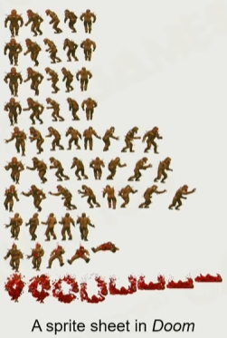
  * Sprite Animation in Modern Game
* Live2D
  * 将人物的每个身体组件拆开，通过各种变换进行组合
  * 每个组件：深度 + 控制点 + 关键帧
  * 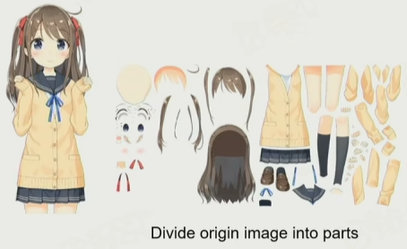

### 8.2 3D Animation Techniques in Games

* DoF (Degrees of Freedom)
  * 对于一个刚体来说，空间中有6个DoF
    * translation x/y/z，rotation yaw/roll/pitch
* Rigid Hierarchical Animation
  * 刚体 + 层级
* Per-vertex Animation
  * 用预处理texture来记录每个顶点随时间变化的位置
  * 适用于：旗帜、水流
* Morph Target Animation
  * 调整多个预设动画的权重，通过插值来得到最终效果
* 3D Skinned Animation
  * 骨骼驱动动画
* 2D Skinned Animation
  * 2D的骨骼驱动动画
* Physical-based Animation
  * 适用于：Ragdoll，Cloth and Fluid Simulation，IK
* Animation Content Creation
  * 如何创造Animation：手K动画，Motion Capture

### 8.3 Skinned Animation Implementation

* Step
  * 
* Different Spaces
  * Local Space ∈ Model Space ∈ World Space
  * Local Space: 骨骼的坐标系
* Skeleton for Creature
  * Category：Humanoid Skeleton，Non-humanoid Skeleton
  * 对于Humanoid Skeleton来说，Pelvis Joint在脊椎的最下方的一个骨骼上，而Root Joint在Pelvis的正下方和脚底平面上
* Joint vs. Bone
  * 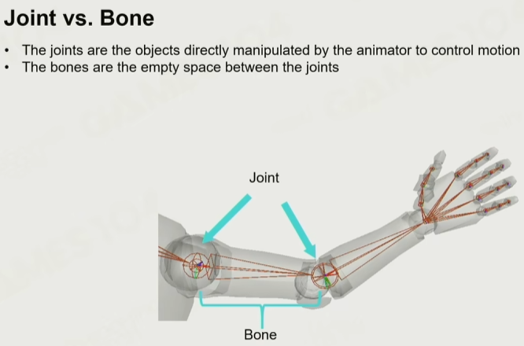
  * Joint有自由度，Bone无自由度，会被Joint决定
* Humanoid Skeleton in Real Game
  * 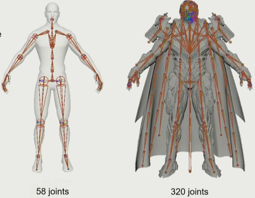
* Joints for Game Play
  * Weapon Joint，Mount Joint
  * 人物拿武器、骑乘，实际上都是把另一个模型绑定在某个特殊的joint上
* Pelvis Joint 和 Root Joint
  * root joint，在跳跃和蹲下的时候都起作用
  * 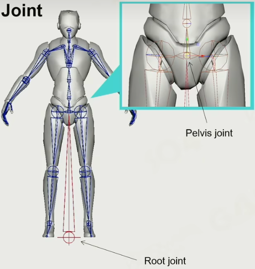
  * 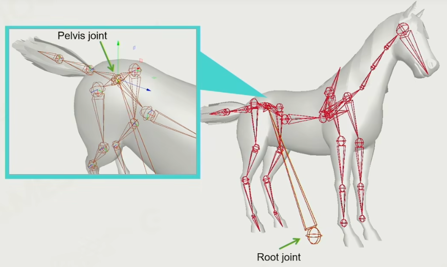
* Bind Animation for Objects
  * 两个模型绑定在一起的时候，位置和方向都要一起变（比如汽车转向，人也转向）
    * 更类似于一个卡槽，方向也要变
* Bind Pose (T-Pose vs. A-pose)
  * T-Pose的问题，肩膀被挤压，所以现在行业中更常用A-Pose
* Skeleton Pose
  * Joint Pose共有9DoFs
    * Position，Orientation，Scale

### 8.4 Math of 3D Rotation

* 2D Orientation Math

* 3D Orientation Math - Euler Angle

  * 可以绕三个不同的轴旋转，也可以绕空间中任意一个轴旋转
  * 欧拉角，公式如下
    * 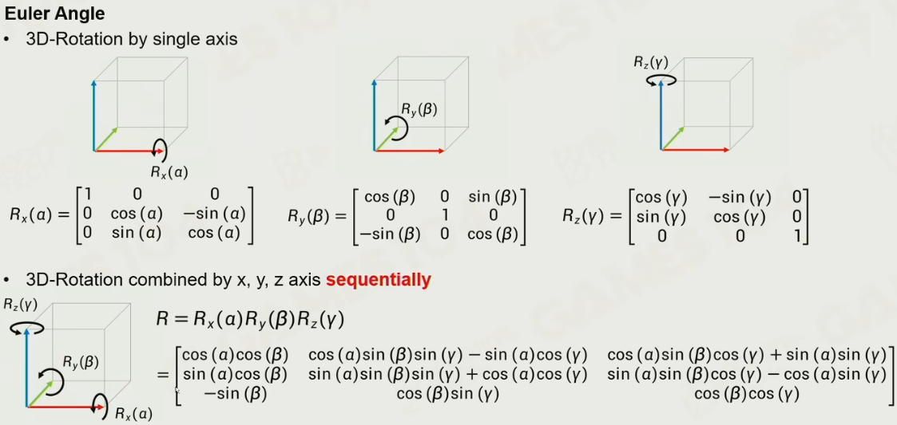
  * 欧拉角的问题
    * **Order Dependency**
      * 旋转顺序不可变，先转x再转y ≠ 先转y再转x
    * **Gimbal Lock**
    * Hard to interpolate
    * Difficult for rotation combination
    * Hard to rotate by certain axis

* 3D Orientation Math - Quaternion

  * 四元数的原理只在二维和三维空间中成立
    * 原理和 “五次及五次以上的方程没有解析解” 有关
  * 四元数
    * $q = a + bi + cj + dk (a, b, c, d \in R)$
    * $i^2 = j^2 = k^2 = ijk = -1$
    * $\Rightarrow ij=k,\ ik=-1,\ etc..$
    * 四元数的Product
      * 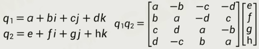
    * 四元数的Norm
      * 平方和再开根
    * 四元数的Conjugate（共轭）
      * $q^*=a-bi-cj-dk$
    * 四元数的Inverse
      * $q^{-1}q=qq^{-1}=1$
  * 四元数的应用
    * 用Quaternion表达旋转
      * 设旋转轴为 $\vec{u} = (u_x, u_y, u_z)$，旋转角为 $\theta$
      * 则四元数为 $q = cos(\frac{\theta}{2}) + u_xi\ sin(\frac{\theta}{2}) + u_yj\ sin(\frac{\theta}{2}) + u_zk\ sin(\frac{\theta}{2})$
    * 将向量 $\vec{v}$ 绕向量 $\vec{u}$ 旋转角度 $\theta$
      * 原向量Quaternion：$v' = 0 + v_x i + v_y j + v_z k$
      * 旋转Quaternion：$q = cos(\frac{\theta}{2}) + u_xi\ sin(\frac{\theta}{2}) + u_yj\ sin(\frac{\theta}{2}) + u_zk\ sin(\frac{\theta}{2})$
      * 旋转Quaternion的Conjugate：$q = cos(\frac{\theta}{2}) - u_xi\ sin(\frac{\theta}{2}) - u_yj\ sin(\frac{\theta}{2}) - u_zk\ sin(\frac{\theta}{2})$
      * 新向量Quaternion：$v_{rotated} = qv'q^*$
    * 注：旋转轴 $\vec{u}$ 必须为单位向量，这样旋转四元数才是单位四元数，从而保证旋转不会改变向量长度
    * 矩阵形式
      * 将 $v_{rotated} = qv'q^*$ 进行展开，并且按项进行合并，最后可以得到关于 $v_x, v_y, v_z$ 三个项的一个多项式，将其整理得到一个矩阵，即为四元数旋转的矩阵形式！
      * 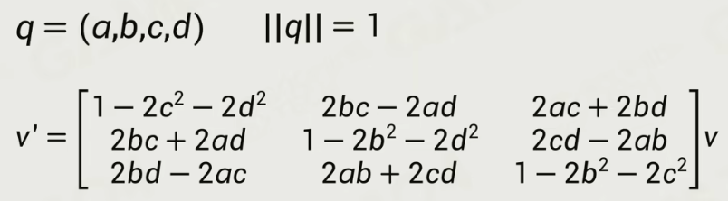
    * 反向旋转
      * 即为旋转四元数的Inverse

### 8.5 Joint Pose
Joint Pose的姿态

* Position
* Scale

## 9. Advanced Animation Technology

### 9.1 Animation Blending

* Animation Blending
  * 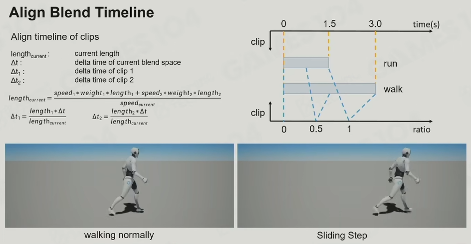

* Blending Space

### 9.2 ASM (Animation State Machine)

* Animation State Machine
  * Case：Jumping —— ASM
  * 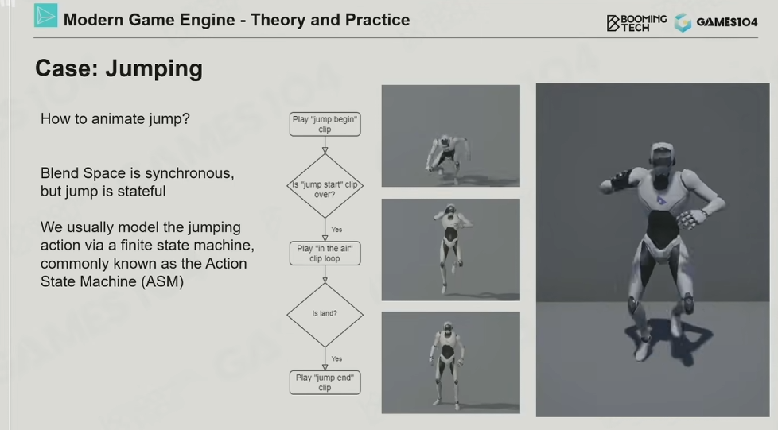
  * ASM的Cross Fades
    * 各种动画的过渡应该是不一样的
    * 例如起跳，那么就不应该用平滑过渡等
* Layer ASM

### 9.3 ABT，Animation Blend Tree，动画树

* 动画树实际上适用于结合多种动画的，而不是做状态机的
  * 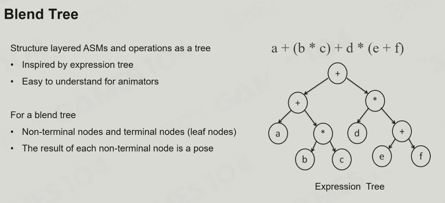
* ABT是Layer ASM的超集，ABT是一个递归结构
* 【TODO，第9集剩下的没看】

## 10. Physics System - Basic Concepts

* 两节课：基本概念 + 应用

### 10.1 Physics Actors and Shapes

* 物理世界中的 **基本对象** 被称作 **Actor** 或者Shape

* Actor的类型：Static、Dynamic、Trigger、Kinematic

* Actor Shapes
  * 因为物理解算开销大，所以我们倾向于使用简单的shapes来作为基本单位
  * **物理运算的开销实际上非常大**
  * 运算量：Spheres ≈ Capsules ≈ Boxes < Convex Meshes < Triangle Meshes；Height Fields
  
* Shape Properties
  * Mass (Density)、Center of Mass、Physics Material (Friction & Restitution)
  
* **Forces**
  * 例子：Gravity、Drag、Friction、**Impulse（用来表示瞬间的力）**
  
### 10.2 Movements

* 牛顿第一定律：当一个物体不受外力时，则该物体作匀速直线运动
  * **游戏引擎里常常用数学公式来表达物理定律**
* 牛顿第二定律：F=ma
* Explicit(Forward) Euler's Method
  * 问题：误差会积累，能量会变多
* Implicit(Backward) Euler's Method
  * 问题：能量会变少
    * 但是因为世界中有摩擦力，所以实际上 **我们接受能量损失**！（物体可以禁止不动，只要不突然起飞就行）
* Semi-implicit Euler's Method
  * 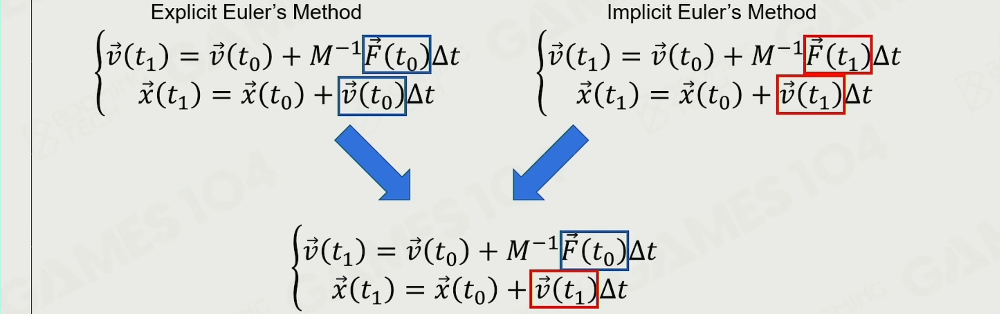
  * 假设：用当前力求出下一时刻的速度，用下一时刻的速度预测下一时刻的位移
  * 优点：大部分情况下稳定、易于计算、能量守恒
  * 所以大家99%的情况下都在使用Semi-Implicit Euler's Method
* 这些方法用于：给定物体和力，求出速度和位移

### 10.3 Rigid Body Dynamics

* RigidBody的关键在 **旋转**
* RigidBody的属性
  * Orientation $R$ 朝向（姿态）：用1个Matrix3x3表达
  * Angular Velocity $\vec{\omega}$ 角速度：用3个Vector3表达
    * 如下图：不在旋转轴的一点 $r_p$、指向旋转轴的向量 $\vec{r}$、切向速度 $\vec{v}$
    * 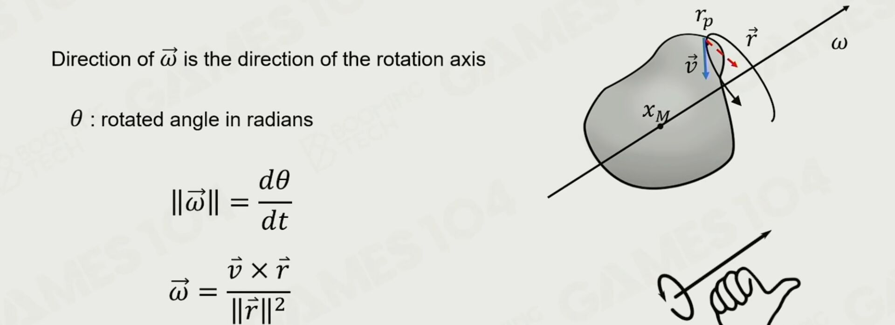
  * Angular Acceleration $\vec{\alpha}$ 角加速度
  * Rotational Inertia(Inertia Tensor) $I$ 转动惯量(惯性张量)：$I = R \cdot I_0 \cdot R^T$
    * 例子：长轴转起来费劲一些、短轴转起来简单一些
    * 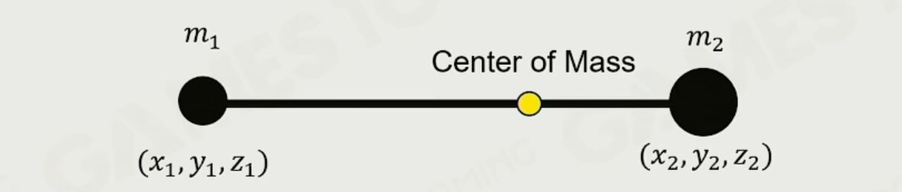
  * Angular Momentum $\vec{L}$ 角动量
    * 例子：旋转时，张开手臂，旋转速度变慢
  * Torque $\vec{\tau}$ 力矩
* 总结
  * 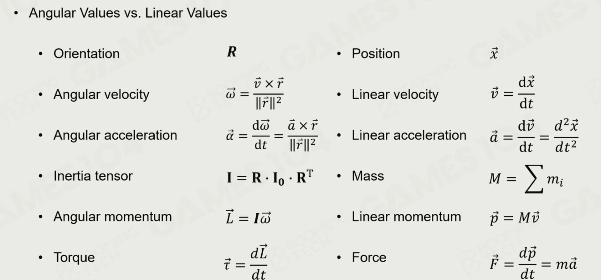
* Application —— 桌球
  * **球会旋转！**
  * 球杆击球的时候，会产生冲量......等，非常复杂

### 10.4 Collision Detection

* 现代游戏引擎处理碰撞，通常有两个阶段
  * Broad Phase：用AABB简化计算
  * Narrow Phase：精细计算，并得到碰撞点等等
  * 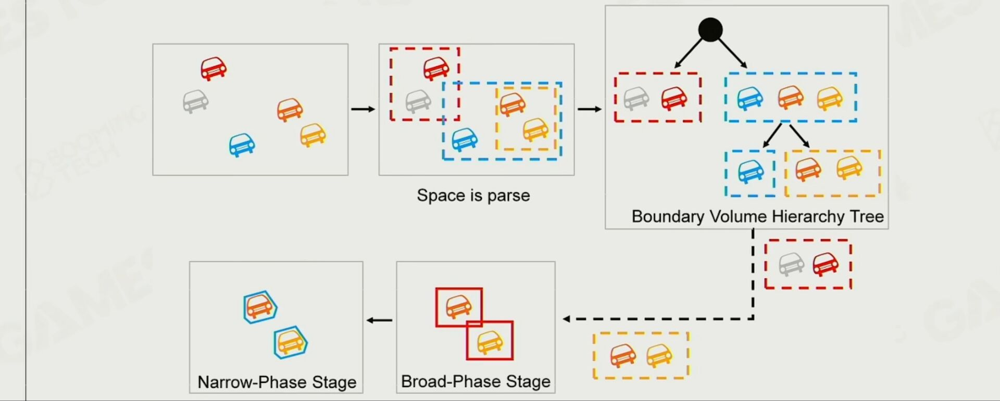
* Broad Phase
  * 目的：加速
  * 方法一：BVH
  * 方法二：若每个BoundingBox都和坐标轴对齐，那么可以用 **Sort and Sweep** 策略（分离轴算法）
    * 如果一个BoundingBox其中一个轴坐标的Min和Max，在排序后，不相邻时，那么该轴相交
* Narrow Phase
  * 目的：精细地计算是否碰撞，并得到接触点、接触面法线......等
  * 方法一：Basic Shape Interaction Test
    * 球vs球......等
  * 方法二：Minkowski Difference-based Methods
    * 定义 Minkowski Sum：集合A + 集合B = $\{\vec{a}+\vec{b} \ | \ \forall \vec{a} \in A, \forall \vec{b} \in B\}$
      * 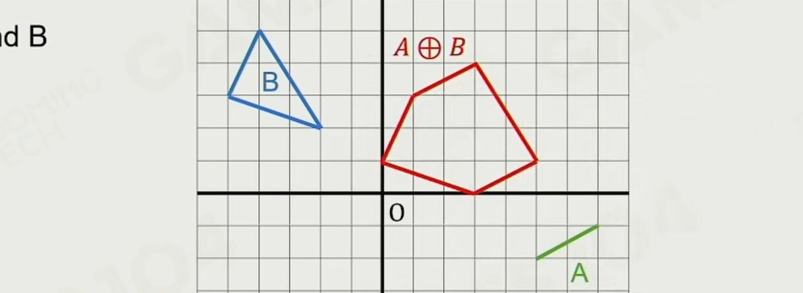
      * 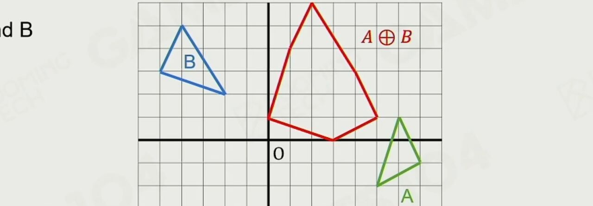
    * 定义 Minkowski Difference：给减集合的坐标取相反数即可
    * **性质：若 两个凸包的闵科夫斯基差 经过原点，则两个凸包相交！**
    * 如何求解闵科夫斯基差：**GJK Algorithm**，算法略，和单纯形有关
  * 方法三：Separating Axis Theorem (SAT)
    * 略
    * 貌似和做cgpc题目的时候学到的SAT优点区别

### 10.5 Collision Resolution

* 如果两个物体碰撞了怎么办？
* 方法一：Applying Penalty Force，给物体增加一个penalty force
* 方法二：Solving Constraints，基于拉格朗日力学，将力学建模成约束问题
  * **目前物理引擎中最常用的方法：Gauss-Seidel Method 高斯塞德尔方法**

### 10.6 Scene Query

* 以场景为单位提供一些API
* Raycast 光线生成（指光线求交）
  * 类型：Multiple hits、Closest hit、Any hit
* Sweep 横扫
* Overlap 覆盖

### 10.7 Efficiency, Accuracy, and Determinism

* 模拟优化：对actor分组，分成一个个island
  * 比如一个island内部基本已经静止了，就直接跳过这个island（Sleeping）
* Continuous Collision Detection (CCD，连续物理碰撞)
  * 问题：一个物体移动速度过快，那么可能会直接穿过某个比较薄的障碍物
  * CCD是类似 距离场优化光追，得到估计的安全距离，再逐步缩小步长
* 确定性模拟
  * 目的：确保 **相同的初始状态** 会得到 **同样的结果**
  * 要求：固定步长、确定的求解顺序、浮点数一致性

## 11. 
