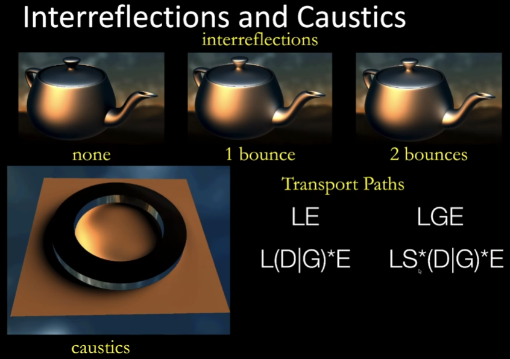

# GAMES202 Notes

## 1. Real-time Shadow

* Shadow Mapping
* PCF
* PCSS
* VSSM(VSM)
* Moment Shadow Mapping
  * Motivation：解决Light Leaking
  * Approach：用更高阶的矩来估计引用（VSM使用了2阶矩）
  * 
  * 
  * 【可以读一下Moment Shadow Mapping这篇paper，工业界技巧比较多】
* Distance Field Soft Shadow
  * 优点：快、质量高
  * 缺点：存储开销大
  * Usage 1
    * Ray Marching（Sphere Tracing），基于公式 $SDF(x)$ == a "safe" distance around
  * Usage 2
    * Determine the percentage of occlusion
    * 
    * 

## 2. Real-time Environment Mapping

* Environment Lighting：环境光照
* 补充：PBR
  * Fresnel Term：描述有多少光被反射，有多少光被折射
    * 入射光与法线平行时，反射少；入射光与法线垂直时，反射多
    * 影响Fresnel Term的因素：材料的折射率、是否极化、导体或绝缘体
    * **Schlick‘s Approximate**：对Fresnel Term进行近似，实时渲染极常用
  * Microfacet Material：用微表面建模材质。
    * 微表面模型认为：从远处看，看到的是材质和外观；从近处看，看到的是几何
    * 

### Shading from Environment Lighting

* Image-Based Lighting (IBL)
  * IBL是一类光照技术的统称，例如：Split Sum
* Split Sum
  * 根据渲染方程，将BRDF的光照拆出来
    * 
    * 1st Stage：BRDF入射光区域（即 $\Omega_{f_r}$）内的平均光照
    * 2nd Stage：BRDF
  * 1st Stage：通过预计算MIPMAP，在镜面反射方向通过单次texture query得到平均光照
    * 
  * 2nd Stage：材质已知，通过预计算，得到所有可能的输入参数对应的函数结果。在着色时通过采样得到。
    * 假设材质模型为Microfacet BRDF，通过the Schilick's approximation和一些数学近似，将参数简化为三个：base color $R0$，the half angle $\theta$，roughness
      * $R0$ 通过数学拆开，剩下两个参数通过打表得到，即可通过单次texture query得到BRDF项。
  * 效果图
    * 
* Spherical Harmonics
  * SH是二维中，一系列定义在球面上的基函数（输入2D向量，输出标量）
  * SH两两正交。因此，在求系数的过程中，可以直接将原函数乘以基函数，得到该基函数的系数。这个过程实际上就是 **投影**
  * 
    * 第L阶的SH有 $-L\sim L$ 个SH，前N阶的SH有 $N^2$ 个SH

### Shadow from Environment Lighting

* Difficult to implement
* Related research

  * Imperfect shadow maps
  * Light cuts
  * RTRT (might be the ultimate solution)
  * Precomputed radiance transfer
* Recall：Prefiltering + Single query = No filtering + Multiple Queries
* 用SH描述光照

  * 对于 **Diffuse** 物体，只需要3阶（9个）SH便可以精确描述Diffuse物体的光照
  * 只用前两阶的结果，甚至可以把公式写成一个二次型，最后就只需要一次矩阵运算就可以得到光照结果，代码及其简单
  * 
  * 
  * 
* **Precomputed Radiance Transfer，PRT**

  * 目标：实现环境光
  * Brute-force实现
    * 
    * 渲染这个shading point时，暴力计算6\*64\*64个点，并统计结果
  * Basic Idea
    * **前提：假设场景不变，只有lighting才能变化**
    * 将积分拆成 表示lighting的 $L(i)$ 和 表示light transport的 其余项
    * light transport可以通过SH预计算得到
    * 所以接下来只考虑lighting
  * 我的疑问：限制这么多，为什么不直接预计算每个shading point的颜色？
    * 我的答案：因为PRT在限制中找到了一个平衡，预计算一些内容，使得光照可以在运行时切换等等
  * SH的美妙性质
    * 正交
    * 投影简单
    * 旋转简单（通过旋转基函数，来旋转原函数）
      * SH性质：一个SH旋转后，可以被同阶的其他SH的线性组合表示（和欧几里得空间中的基函数一样）
      * **因此，支持光源旋转**
    * 卷积简单
    * 低频
  * Diffuse Case
  * Glossy Case
    * 暴力存所有出射方向的值
  * 总结：PRT预计算了lighting和light transport
    * 预计算可以针对vertex计算，然后通过插值得到fragment的值
    * 
  * 光线分类
    * 
    * caustic，焦散，LS\*(D|G)\*E
    * 说明：任意复杂的Light transport都可以合并表示
  * 其他基函数：Wavelet（定义在2D图形块上），Zonal Harmonics，Spherical Gaussian

## 3. Real-time Global Illumination (3D)

* RSM
  * 
  * 加速：只采样周围······
  * 问题
    * 性能
    * 没有visibility check
* Light Propagation volumes，LPV
  * 算法流程
    * 纯实时算法
    * Step 1，RSM
    * Step 2，离散化空间为体素，将RSM的光注入体素，每个SH用体素表达光源（2阶4个SH即可）
    * Step 3，Propagation，迭代个4~5次即收敛
  * 问题
    * Light Leaking
* Voxel Global Illumination，VXGI
  * 算法流程
    * 先将场景全部体素化
    * 一个two-pass算法
      * 第一步，将直接光照注入体素
        * 
      * 第二步，根据每个体素材质，cone tracing，往特定方向圆锥覆盖的体素加光照
        * 
    * 对于Diffuse物体，需要发出多根圆锥
      * 
  * 优化
    * 给体素做Hierarchy
  * 优点
    * 效果非常好
    * 
  * 缺点
    * 效率低，特别是Diffuse材质

## 4. Real-time Global Illumination (Screen Space)

* SSAO
* HBAO
  * 相比SSAO的优化：根据法线，在半球内采样；只在一定范围内采样
* SSDO
  * AO的采样点被挡住时，计算阴影
  * DO的采样点被挡住时，计算遮挡物对着色点的颜色贡献
  * 
* SSR（SSRT）
  * 牛逼，真神
  * 
  * 
    * 反射的时候多反射一些光线就好了
  * 
    * 法线偏移，就和我自己实现的一样
  * 
    * 奇怪的粗糙度
* SSRT加速结构
  * 生成深度图的 **最小值MIPMAP图**，然后二分距离，使得只需要logn次采样
  * 
* SSRT的问题
  * Missing Geometry Info
  * Edge Cutoff，解决方案：Edge Fading
* SSRT的优化方向
  * 锐利和模糊的反射
    * 
  * 类似PCSS的Cone Tracing
    * 
  * 各向异性采样（雨天地板），BRDF为椭圆锥
    * 
  * 模糊与扰动
    * 
* **Summary of SSR**
  * Pros
    * Glossy和Specular的反射效率非常高
    * 高质量
    * 【没懂】No spikes and occlusion issues
  * Cons
    * Not as efficient in the diffuse case
    * Missing infomation outside the screen

## 5. Real-time Physically-based Materials

* PBR Materials in RTR
  * For surfaces
  * For volumes

### 5.1 Microfect BRDF

* 
* Fresnel Term，原始计算公式非常复杂，需要考虑导体/绝缘体，是否极化等。RTR中，使用Schlick's Approximate进行近似。
* Normal Distribution Function（NDF）
  * 有许多模型可以描述NDF，比如Beckmann，GGX，etc
  * Beckmann NDF
    * 
    * $\alpha$，表示roughness
      * 在代数上，$\alpha$ 表示标准差，所以越大，该类高斯函数越宽
      * 在渲染上，就表示越rough
    * $\theta_h$，表示法线和半程向量的角度插值
    * 为什么这里用 $tan^2\theta_h$，而不用 $\theta_h^2$ 呢？因为这里需要将数值映射到 $[0, +∞)$
  * GGX（Trowbridge-Reitz，TR）
    * 一个long tail长尾函数，衰减速度慢
    * 优势：GGX渲染Glossy物体，高光边缘会有光晕的效果，所以现在大家比较喜欢
    * 
  * 
    * 可以看到，GGX的高光的过渡带强烈很多
  * **Extending GGX（Generalized Trowbridge-Reitz，GTR）**
    * 通过引入新的参数，使得尾巴更长（曲率更小）
    * 
    * 可以统一Beckmann和GGX，以后推荐先用 **GTR**
* Shadowing-Masking Term（Geometry Term）
  * 解决目标：微表面产生的子遮挡
    * 在grazing angles（低入射角）时，需要有自遮挡效果。该项值接近0
    * 在光线垂直入射平面时，不需要有自遮挡效果。该项值接近1
    * 
    * 左侧为Shadowing，右侧为Masking【不确定】
  * 从数值角度理解为什么要有Shadowing-Masking Term
    * 
    * 在grazing angle时，$(n, i)$ 值接近 $0$，所以整个公式的数值会非常大，需要另外一个项来和 $G(i, o, h)$ 抵消，使得 $f(i, o)$ 的值是正常的
  * **Smith Shadowing-Masking Term**
    * 一个常用的模型
    * 
* Microfect BRDF的问题：Missing Energy
  * 
  * 可以发现，右侧diffuse的材质，整体非常暗，能量损失了特别多！
  * 注：这个测试叫 **White Furnace Test**，用于测试你的BRDF是否存在能量损失
  * 解决方案：模拟diffuse材质中多次弹射后的结果。但对于RTR来说太慢了。
    * RTR近似方法：The Kulla-Conty Approximation
* **The Kulla-Conty Approximation**
  * 通过一个经验性的方法，补全多次弹射丢失的能量
  * **Kulla-Conty Approximation 给出了一个新的BRDF，使得渲染时同时计算两种BRDF，就可以补全能量的缺失！**
  * 在渲染方程中，考虑任意BRDF，计算出射能量为
  * 则损失能量为：
  * 为什么这里可以假设总能量为 $1$ 呢？因为在white furnace test中，光线都是垂直入射垂直离开，且radiance一致
  * 因为BRDF通常为可逆，所以考虑对称性，最后公式应该形如：
    * 其中，$c$ 为归一化常数
  * 计算后，得到Kulla-Conty Approxi.为：
  * 然后，我们需要计算 $E_{avg}$，因为这个积分难以计算，所以我们很自然地使用 **预计算/打表** 的方法
  * 
  * **效果**
    * 
* 更进一步的情况：**如果材质有颜色怎么办？那么本来就应该有能量损失**
  * 解决方案：计算总能量损失
  * 定义Average Fresnel，即表示能量损失
    * 
  * 
  * 
* **However，An Undesirable Hack**
  * hack要有理论的hack，不能随便瞎写。比如在机器视觉中，有人觉得Microfacet BRDF偏暗，就给Microfacet BRDF加了一个diffuse lobe
  * 闫老师锐评：完全错误、不能更糟糕了、我从来没有教过你这个
  * 
  * 原因：物理上错误、没有能量守恒（可能导致材质发光）

### 5.2 Shading with Microfacet BRDF (Polygon Lighting)

* Method：Linearly Transformed Consines (LTC)
* 【没听懂，原因是对BRDF不够熟悉，所以没法听懂】

### 5.3 Disney's Principled BRDF

* Motivation
  * 微表面模型无法表达的材质，比如多层材质（清漆+木头）
  * 微表面模型难以使用，难以符合艺术家直觉（物理量对艺术家不友好
* High Level Design Goal
  * 直观，对艺术家友好，不要求一定要物理上正确
  * 
* 参数
  * 
  * subsurface，次表面散射（比如皮肤）
  * metallic，金属度
  * specular，镜面反射
  * specularTint，镜面反射的颜色（无色/有色）
  * roughness，粗糙度
  * anisotropic，各向异性程度
  * 以下四者为工业界常用
  * sheen，天鹅绒效果
  * sheenTint，天鹅绒效果的颜色（无色/有色）
  * clearcoat，透明外层（比如清漆+木头）
  * clearcoatGloss，透明外层的光滑程度
* 优缺点
  * 理解简单、控制简单
  * 表达空间非常大，可以表示非常多种材质
  * 开源实现多
  * Not Physically Based
    * 不是大问题
  * 巨大的参数空间
    * ML难以学习
  * 能量守恒（印象中）

### 5.4 Non-Photorealistic Rendering (NPR)

* Goal：Fast and Reliable Stylization
  * **Artist Driven，需要根据Artist的需求来驱动开发**
* Applications
  * Art，Visualization，Instruction，Education，Entertainment
* 风格化可以有什么？
  * 头发/皮肤描边，shading亮处和暗处分界线明显，但各自区域内颜色相近类似于过了一个Sigmoid
* NPR的核心：分析需要的效果
  * 例子：描边，那么你需要描的边到底是什么？有什么特征？

#### 5.4.1 Outline Rendering（描边）

* 描边的分类
  * 
  * B边界（物理边界），C折痕，M不同材质边界，S多个面共享的边界
  * S是C的子集
* Silhouette Edge描边方法
  * Method 1：法线和观察方向接近垂直，则视为Silhouette Edge。但有时候边的粗细不一定，效果不一定好
  * 【工业界常见方法】Method 2，Backface Fattening：渲染背面的时候，把所有三角形扩一圈
  * 【工业界常见方法】Method 3，图像空间算法，比如Sobel Detector

#### 5.4.2 Color Blocks 色块

* 
* Method 1：渲染时设置阈值
* Metho d 2：图像空间阈值

#### 5.4.3 Strokes Surface Stylization 素描效果

* 第一个问题：什么是素描？
* 注意点：MIPMAP要通过裁剪实现，而不是正常的双线性插值，否则素描笔触密度会发生变化

#### 5.4.4 NPR总结

* NPR最困难/最有趣的地方在于需求分析
* 闫老师认为NPR最重要的是自己分析效果的能力

## 6. Real-time Ray Tracing

* 硬件
  * RTX支持1SPP（Samples Per Pixel）
* 光路
  * 一条光路由N次弹射与N次 Visibility Check 组成
  * 因为光路的第一次弹射渲染效果和光栅化是一样的，所以大家通常直接用光栅化实现第一次弹射
* 问题
  * RTX只能实现1SPP，所以RTRT最关键的技术是 **Denoising**
  * 所以，**RTRT = Path Tracing + 硬件 + Denoising**

### 6.1 Temporal

* RTRT的Key Idea：**Temporal**
* 初步假设：
  * 滤波当前帧时，假设之前所有帧已经滤波完毕
  * 假定运动连续
  * 使用Motion Vectors定位同一物体在上一帧的位置
  * 间接提高SPP
* Back Projection
  * 目标：定位同一物体在上一帧的像素位置
  * Motion Vector和Optical Flow(光流)的区别在于：
    * Motion Vector是确定性的，掌控整个渲染过程，知道物体的世界坐标、变换矩阵等
    * Optical Flow是不确定的，只使用了屏幕空间信息
* Temporal Accumulation / Denoising
  * 
* 效果对比图
  * 
  * 

### 6.2 Temporal Failure

* Failure Case 1：Switching Scenes
* Failure Case 2：Walking Backwards in a hallway（Screen Space Issue）
* Failure Case 3：Suddenly Appearing Background（Disocclusion）
  * 
  * 新的信息，从被遮挡的状态，变成了，未被遮挡的状态
  *  如果强行使用的话，就会导致：拖尾（Lagging）
* Failure Case 4：Detached/Lagging Shadows
  * 几何不变，但是光源变化，会导致阴影出现detached或者lagging
* Failure Case 5：Glossy地板导致反射滞后
  * 
  * 注：这张图看不出来，只是用于帮助我回忆场景。这里地板反射的光会有lagging现象
* 这里的Failure Case4和5是另一类Failure Case：几何不变，Shading变化
* 主流Solution
  * Clamping：修正上一帧结果
  * Detection：检测是否使用上一帧结果
  * 导致的Problem：重新引入Noise
* Temporal Accumulation和抗锯齿中的TAA非常相似

### 6.3 Spatial Filter

* 问题：假设我们现在需要用Low-pass Filter去掉高频噪声
* 输入：
  * 一幅带噪声的图 $\tilde{C}$
  * 一个滤波核 $K$（不同像素的滤波核可能不同）
* 输出：
  * 一副过滤后的图 $\bar{C}$
* 假设：我们现在使用高斯滤波核来filter中心像素
  * 这里就类似Bloom效果中的高斯分布
  * 

#### 6.3.1 Bilateral Filtering 双边滤波

* 高斯滤波的问题：会模糊边界。但大部分情况下边界不需要被模糊
* 双边滤波
  * 
  * exp内前者为原滤波的高斯函数，后者为考虑颜色的新高斯函数。颜色差异大的时候，广贡献更小
* 效果图，效果很好
  * 

#### 6.3.2 Joint(Cross) Bilateral Filtering 联合双边滤波

* 观察
  * 高斯滤波：1 metric （distance）
  * 双边滤波：2 metrics（position distance & color distance）
  * 联合双边滤波：考虑更多的metrics！
    * 在RTRT中，我们可以将normal，albedo等gbuffer内容加入联合双边滤波。
* 联合双边滤波 = 双边滤波 + more metrics
  * 就是这么简单
* 联合双边滤波也不一定要用高斯函数，也可以用指数函数、Cosine函数等
  * 
* 为什么要这么做？
  * 

### 6.4 Implementing Large Filters

* Observation
  * 小filter，不影响
  * 大filter，性能开销非常大
* Solution 1：Seperate Passes
  * 类似Bloom，把N*N的滤波器拆成两个分别为1\*N和N\*1的滤波器
  * **但是**，只有简单的高斯滤波可以拆分，复杂一点的就没法拆分（比如双边滤波）
  * **虽然，理论上没法拆分；但是**，工业界中，有人还是用近似强行拆分
* Solution 2：Progressive Growing Sizes
  * 先用小filter、再用中filter、再用大filter······
  * 
  * 为什么使用越来越大的filter？
    * 使用大filter == 去除低频噪声（可以考虑高斯滤波，滤波核越大，越模糊）
  * 为什么可以跳过一些采样点？
    * 采样 == 重复频谱【有点没理解】
    * 
    * 【没听懂】
* **拓展**
  * PCSS采样点数太多，怎么办？
    * 其实也可以用类似的方法处理，这实际上正是工业界中使用PCSS的方式
  * SSR的glossy物体要反射很多根光线，怎么办？
    * 可以只射出少量光线，然后使用滤波方法处理
  * **工业界中，很多技术都是先实现一个noisy的结果，再用denoising方法**
* 

